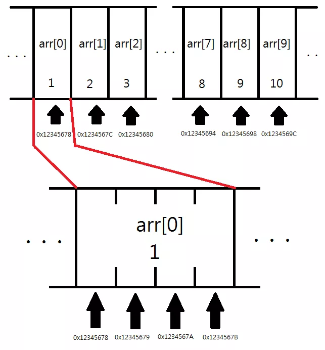
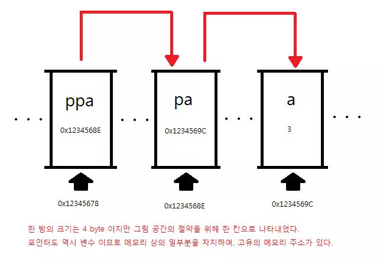
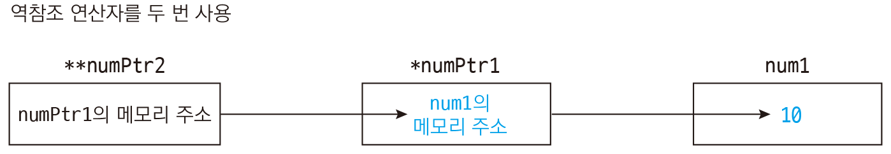
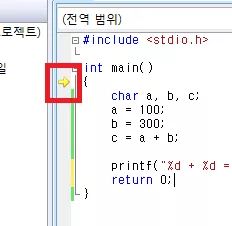

# C언어 기초

## Nov 2021

<details>
<summary>2021/11</summary>
<div markdown="1">

<details>
<summary>11/01</summary>
<div markdown="1">

### 21-11-01 
1. C언어의 정의
2. 기수법 / 2진수 ↔ 10진수 ↔ 16진수 변환 / bit, byte, word, double word (메모리 단위)
3. 변수 - 정수형, 실수형 / 메모리 주소 / 변수 이름 주의사항
4. 연산자 - 산술, 대입, 비트, 쉬프트 / 연산 우선 순위 / 2의 보수 / 정수 오버플로우
5. scanf
6. if / if ~ else
7. for / while / do ~ while

</div>
</details>

<details>
<summary>11/02</summary>
<div markdown="1">

### 21-11-02
1. switch, case
2. 형 변화(캐스팅), 부동 소수점, 정규화
3. 배열(Array), 소수(Prime Number), 상수(Constant)</br>
  ※ 배열의 원소에 접근할 때 **우리가 참조하는 원소의 위치가 배열의 크기 보다 작은지 확인**

  </br>3-1. 소수  
  1과 자신을 제외한 약수가 하나도 없는 수  
  >**※ 배열의 원소의 수를 변수 크기 지정 시 특정한 값이 들어있는 변수를 사용할 수 없다.**
  ``` c
  int total = 3;
  int arr[total];
  ```
  _위와 같이 사용시 에러 발생_

  </br>3-2. 상수  
  처음 정의 시 값이 바로 주어지고, 값의 변경이 불가능하다.  
  >**※ 배열의 크기를 상수로 지정할수 없다.**
  
  </br>3-3. 변수 및 배열을 초기화 하지 않고 사용 시 에러 발생  
  >예외)
  ```c
  int arr[3] = {1};
  →/* compiler */→
  int arr[3] = {1, 0, 0};
  ```
  >**※ 특별히 초기화 하지 않은 원소들에는 0이 자동으로 들어가게 된다.**

</div>
</details>

<details>
<summary>11/03</summary>
<div markdown="1">

### 21-11-03
1. 배열 연습문제(/src/modoocode)  
1-1. 입력받은 학생들의 성적은 내림차순으로 정렬  
<br>1-2. 입력받은 학생들의 성적을 막대 그래프로 표현 (해결 x)

</div>
</details>

<details>
<summary>11/04</summary>
<div markdown="1">

### 21-11-04
1. 다차원 배열
  - 2차원 배열
  - 3차원 이상의 고차원 배열

  </br>1-1. 2차원 배열
    ```c
    int arr[3][2];
    ```
    > 위 배열을 그림으로 보면 아래와 같다

|`arr[0]`|`arr[1]`|`arr[2]`|
|:---:|:---:|:---:|
|↓|↓|↓|
|`arr[0][0]`|`arr[1][0]`|`arr[2][0]`|
|`arr[0][1]`|`arr[1][1]`|`arr[2][1]`|

→ ```arr[m][n];``` 과 같이 배열을 선언한다면(m, n은 임의의 정수값), m × n 개의 변수를 가지는 배열을 선언한 것이다. 

- 2차원 배열이나 1차원 배열 모두 메모리 상에서 연속적으로 존재 (메모리는 항상 1차원)

|메모리|
|---|
|`arr[0][0]`|
|`arr[0][1]`|
|`arr[0][2]`|
|`arr[1][0]`|
|`arr[1][1]`|
|`arr[1][2]`|
|`arr[2][0]`|
|`arr[2][1]`|
|`arr[2][2]`|

- 하지만 2차원 배열을 생각할 때 해당 원소들이 아래 표처럼 2차원 공간상에 배치 되어 있다고 생각할 수 있다.

|`arr[0][0]` 1|`arr[0][1]` 2|`arr[0][2]` 3|
|---|---|---|
|`arr[1][0]` 4|`arr[1][1]` 5|`arr[1][2]` 6|
|`arr[0][1]` 7|`arr[1][1]` 8|`arr[2][2]` 9|

※ **일차원 배열은 한 개의 인덱스로 원소에 접근하는 것**이고, **이차원 배열은 두 개의 인덱스로 원소에 접근하는 것**이다.

</div>
</details>

<details>
<summary>11/05</summary>
<div markdown="1">

### 21-11-05
1. 2차원 배열 실습(/src/modoocode)
2. 배열 정의  
`int arr[2][3] = {1,2,3,4,5,6};`  
`int arr[2][3] = {{1,2,3},{4,5,6}};`  
`int arr[] = {1,2,3,4};` = 
`int arr[4] = {1,2,3,4};`
> 위와 같이 정의 가능하다.

`int arr[];`
>하지만 위와 같이 정의 하는것은 불가능하다. 위처럼 배열을 정의한다면 컴파일러는 우리가 어떠한 크기의 배열을 정의하고 싶은지 모르기 때문에 오류가 발생한다.

  2-1. 2차원 배열의 정의  
  `int arr[][3] = {4,5,6}, [7,8,9}};`
  >비어있는 대괄호 안은 '2'가 들어간다.

  `int arr[][2] = {1,2},{3,4},{5,6},{7}};`
  >배열 정의 시 `arr[][2]`라고 했기 때문에 무조건 원소가 2인 1차원 배열들이 생기게 된다. 즉 7이 속한 1차원 배열에는 원소가 한 개인 것이 아니라 마치 `arr[3] = {1}`고 해도 상관 없는 것 처럼 8번째 원소가 들어갈 자리를 비워 놓게 되어 틀린 문장이 아니다.

  `int arr[2][] = {{4,5,6},{7,8,9}}`
  >**다차원 배열의 경우 맨 앞의 크기를 제외한 나머지 크기들을 정확히 지정해줘야 오류가 발생하지 않는다.**

3. 3차원, 그 이후 차원의 배열들

- 3차원 배열(그 이후)의 정의는 2차원 배열과 거의 동일

>일차원 배열은 한 개의 값(x)으로 원소에 접근하는 것이고, 이차원 배열은 두 개의 값(x,y)으로 원소에 접근하는 것이다!  
->  
3차원 배열은 세 개의 값(x,y,z)로 원소에 접근한다.

</div>
</details>

<details>
<summary>11/06</summary>
<div markdown="1">

### 21-11-06
~~1. 포인터~~  
- 1차원 배열 기초 연습 문제(/src/CodeUp)

</div>
</details>

<details>
<summary>11/07</summary>
<div markdown="1">

### 21-11-07
- 일주일치 복습 및 내용 정리/이해

</div>
</details>

<details>
<summary>11/08</summary>
<div markdown="1">

### 21-11-08
- 2차원 배열 기초 연습 문제
(/src/CodeUp)

</div>
</details>

<details>
<summary>11/09</summary>
<div markdown="1">

### 21-11-09
- 포인터
  >포인터 : 메모리 상에 위치한 특정한 데이터의 (시작) **주소값**을 보관하는 변수

  - (포인터에 주소값이 저장되는 데이터의 형) *(포인터의 이름);

  `int *p;`

  - (포인터에 주소값이 저장되는 데이터의 형)* (포인터의 이름);

  `int* p;`

  -> 포인터 p는 int형 데이터의 주소값을 저장하는 변수

- & 연산자
  - 변수 a의 주소값을 알고 싶다면 `&a` 로 쓰면 된다.
  
  >& 연산자를 사용하여 특정한 데이터의 메모리 상의 주소값을 알 수 있다.

</div>
</details>

<details>
<summary>11/10</summary>
<div markdown="1">

### 21-11-10
- **포인터는 특정한 데이터의 주소값을 보관한다. 이 때 포인터는 주소값을 보관하는 데이터의 형에 *를 붙임으로써 정의되고, &연산자로 특정한 데이터의 메모리 상의 주소값을 알아올 수 있다.**
</br></br>
- \* 연산자
  - 주소값에서 해당 주소값에 대응되는 데이터를 가져오는 연산자
</br> -> '_나에게 저장된 주소값에 해당하는 데이터로 생각하세요'_

int 변수 a / 포인터 p
</br>-> 포인터 p에 변수 a의 주소값이 저장되어 있다면, **포인터 p는 변수 a를 가리킨다.** (_포인터 또한 엄연한 변수_이기 때문에 특정한 메모리 공간을 차지한다.)

- 포인터도 타입이 있다.
- 포인터도 변수이기 때문에 포인터에 들어간 주소값이 바뀔 수 있다.

</div>
</details>

<details>
<summary>11/11</summary>
<div markdown="1">

### 21-11-11
- 포인터는 특정한 데이터의 메모리 상의 (시작) 주소값을 보관하는 변수

- 상수 포인터
  - 상수: 어떠한 데이터를 상수로 만들기 위해 `const` 키워드를 붙이면 된다. </br> -> '이 데이터의 내용은 절대로 바뀔수 없다!'
  </br>→→ '절대로 바뀌지 않을 것 같은 값에는 무조건 `const` 키워드를 붙여주는 습관'을 가져야한다.  
</br>
- `const int *`의 의미는 `const int`형 변수를 가리키는게 아니라 `int`형 변수를 가리키는데, **그 값을 절대로 바꾸지 말라**라는 의미 이다.

</div>
</details>

<details>
<summary>11/12</summary>
<div markdown="1">

### 21-11-12
~~포인터 덧셈~~  
11-09 ~ 11-11 까지의 포인터 복습

</div>
</details>

<details>
<summary>11/13</summary>
<div markdown="1">

### 21-11-13
- 11-11 참조(상수 포인터 부분)

```c
/* 상수 포인터? */
#include <stdio.h>
int main() {
  int a;
  int b;
  const int* pa = &a;

  *pa = 3;  // 올바르지 않은 문장
  pa = &b;  // 올바른 문장
  return 0;
}
```

```c
const int* pa = &a;
// int* pa와 같이 정의해도 int *pa와 같음
```

- `const int*`는 `const int`형 변수를 가리키는 것이 아니라 `int`형 변수를 가리키는데, **그 값을 절대로 바꾸지 말라**는 의미이다.  
즉, `pa`는 어떠한 `int`형 변수를 가리키고 있는데 `const`가 붙었으므로 `pa`가 가리키는 변수의 값은 절대로 바뀌면 안된다.

→ `a` 자체는 변수이므로 값이 자유롭게 변경 될 수 있다.  
`pa`를 통해서 `a`를 간접적으로 가리킬 때에는 컴퓨터가 **'아, 내가 `const`인 변수를 가리키고 있구나'** 라고 생각하기 때문에(`const int*` 로 포인터를 정의했기때문) 값을 바꿀 수 없다.

</div>
</details>

<details>
<summary>11/14</summary>
<div markdown="1">

### 21-11-14
- [11-11](#21-11-11) / [11-13](#21-11-13) 참조

```c
/* 상수 포인터? */
#include <stdio.h>
int main() {
  int a;
  int b;
  int* const pa = &a;

  *pa = 3;  // 올바른 문장
  pa = &b;  // 올바르지 않은 문장

  return 0;
}
```

- 위 코드에서는 `const`키워드가 `int*`앞에 있는것이 아니라 `int*`와 `pa`사이에 놓이고 있다.

- 포인터에는 가리키는 데이터의 주소값, 즉 `a`의 주소값이 `pa`에 저장 된다. 따라서, 이 `pa`가 `const`라는 의미는 `pa`의 값이 절대로 바뀔 수 없다는 것인데, `pa`는 포인터가 가리키는 변수의 주소값이 들어 있으므로 `pa`가 처음에 가리키는것(`a`)말고 다른것은 절대로 건드릴 수 없다는 것이다.

```c
*pa = 3; //올바른 문장
```

- pa가 가리키는 값을 바꾸면 안된다는 말은 안했기 때문에 위 문장은 가능하다.

</div>
</details>

<details>
<summary>11/15</summary>
<div markdown="1">

### 21-11-15
- 포인터 덧셈, 뺄셈

```c
#include <stdio.h>
int main() {
  int a;
  int* pa = &a;

  printf("pa의 값: %p \n", pa);

  printf("(pa + 1)의 값 : %p \n", pa + 1); // 포인터의 덧셈

  printf("(pa - 1)의 값 : %p \n", pa - 1); // 포인터의 뺄셈

  return 0;
}
```

- int가 4바이트이기 때문에 pa + 1는 주소값에 4가 더해져서 출력된다.

- int가 아닌 char, double을 사용하더라도 그에 맞게 1바이트, 8바이트 더해지게 된다.

- 위 코드에서 뺄셈의 경우에도 4가 빠지게 된다.

※ C에서는 두 포인터끼리의 덧셈을 허용하지 않는다.  
-> 두 변수의 메모리 주소를 더해서 나오는 값은 이전에 포인터들이 가리키던 두 변수와 관계없는 메모리 속의 임의 지점이다.

- 배열과 포인터

  - 배열은 **변수가 여러개 모인 것으로 생각할 수 있다.**

  - 배열들의 각 원소는 메모리 상에 연속되게 놓인다.

  ```c
  int arr[10] = {1, 2, 3, 4, 5, 6, 7, 8, 9, 10};
  ```

  이라고 정의한다면  위 사진에서 볼 수 있듯, 메모리 상에 연속된 형태로 나타나게 된다. 한개의 원소는 int형 변수이기 때문에 4바이트를 차지하게 된다.

</div>
</details>

<details>
<summary>11/16</summary>
<div markdown="1">

### 21-11-16

~~배열과 포인터 2 (예정)~~
- 휴식일

</div>
</details>

<details>
<summary>11/17</summary>
<div markdown="1">

### 21-11-17
- 배열과 포인터2
  - 포인터로도 배열의 원소에 쉽게 접근할 수 있다.  
  -> 배열의 시작 부분을 가리키는 포인터를 정의한 뒤에 포인터에 1을 더하면 그 다음 원소를 가르킨다.

  - 포인터는 자신이 가리키는 데이터의 '형'의 크기를 곱한 만큼 덧셈을 수행하기 때문  

  ※ 되돌아보기: **배열의 각 원소는 하나의 변수로 생각할 수 있다.**

```c
#include <stdio.h>
int main() {
  int arr[10] = {1, 2, 3, 4, 5, 6, 7, 8, 9, 10};
  int* parr;

  parr = &arr[0];

  printf("arr[3] = %d , *(parr + 3) = %d \n", arr[3], *(parr + 3));
  return 0;
}
```
>*를 이용하여 원소들과 똑같은 역할 수행이 가능하다.

- 배열에서 배열의 이름은 배열의 첫 번째 원소의 주소값을 나타낸다.
이때, 배열의 이름이 배열의 첫 번째 원소를 가리키는 포인터는 ***아니다!***


</div>
</details>

<details>
<summary>11/18</summary>
<div markdown="1">

### 21-11-18
배열 = 배열 / 포인터 = 포인터  
-> 배열의 이름과 첫 번째 원소의 주소값은 엄밀히 다른 것이다.  

(`sizeof`사용 시 배열은 배열의 실제 크기가 나오는 반면, 포인터는 배열 자체 크기가 아닌 포인터의 크기를 알려줌)

- 배열의 이름이 `sizeof` 연산자나 주소값 연산자(`&`)와 사용될 때(예를 들어 `&arr`)의 경우를 제외하고는, **배열의 이름을 사용 시 암묵적으로 첫 번째 원소를 가리키는 포인터로 타입 변환된다.**

- [] 연산자?
  - ex) arr[3] = *(arr + 3)로 바뀌어서 처리됨.
  - 3[arr] -> *(3 + arr)로 바꿔짐.
   따라서, arr[3]과 동일한 결과를 출력한다.

- 포인터의 정의

```c
int* p;
int *p;
/*두 가지 모두 가능하나, 아래 형식을 권장함.*/

int *p, *q, *r; // 올바른 문장
int* p, q, r; // 틀린 문장

// p만 int를 가리키는 포인터, q, r은 평볌한 int형 변수가 된다.
```

</div>
</details>

<details>
<summary>11/19</summary>
<div markdown="1">

### 21-11-19
> 이전 내용
- 배열은 배열이고, 포인터는 포인터이다. 다만;
  - `sizeof`와 주소값 연산자와 함꼐 사용할 때를 제외하면, 배열의 이름은 첫 번째 원소를 가리킨다.
   - `arr[i]`와 같은 문장은 사실 컴파일러에 의해 `*(arr + i)`로 변환된다.

---

- 1차원 배열 가리키기

```c
#include <stdio.h>

int main() {
  int arr[3] = {1, 2, 3};
  int *parr;

  parr = arr; // parr = &arr[0]; 과 동일

  printf("arr[1] : %d \n", arr[1]);
  printf("parr[1] : %d \n", parr[1]);
  return 0;
}
```
---
```c
#include <stdio.h>
int main() {
  int arr[10] = {100, 98, 97, 95, 89, 76, 92, 96, 100, 99};

  int* parr = arr;
  int sum = 0;

  while (parr - arr <= 9) {
    sum += (*parr);
    parr++;
  }

  printf("내 시험 점수 평균 : %d \n", sum / 10);
  return 0;
}
```

※ 포인터 연산에서 1 증가 시킨다면, `parr`에 저장된 주소값에 1을 더하는것이 아니라 `1 *`(포인터가 가리키는 타입의 크기)가 더해진다.

- 여기서 `parr`을 따로 선언한 이유는 `arr`를 증가 시켜서 `*(arr)`로 접근 할 수 없기 때문이다. (아래 코드 참고)

```c
#include <stdio.h>
int main() {
  int arr[10] = {100, 98, 97, 95, 89, 76, 92, 96, 100, 99};

  arr++;  // 오류
  return 0;
}
```

- 배열의 이름이 첫 번째 원소를 가리키는 포인터로 타입 변경 된다고 했을 때, 단순히 배열의 첫 번째 원소를 가리키는 주소값 그 자체가 될 뿐이다.


- 따라서, `arr++`문장은 C컴파일러 입장에서 `(0x7fff1234)++;`를 수행한 것인데, 이는 말이 되지 않는 문장이다.

</div>
</details>

<details>
<summary>11/20</summary>
<div markdown="1">

### 21-11-20
- 포인터의 포인터
  - `int **p;` -> `int`를 가리키는 포인터를 가리키는 포인터

```c
// 예제
#include <stdio.h>
int main() {
  int a;
  int *pa;
  int **ppa;

  pa = &a;
  ppa = &pa;

  a = 3;

  printf("a: %d // *pa : %d // **ppa : %d \n", a, *pa, **ppa);
  //*pa = a, **ppa = *(*ppa) = *pa = a
  printf("&a: %p // pa : %p // *ppa : %p \n", &a, pa, *ppa);
  //pa = &a, *ppa = pa = &a
  printf("&pa: %p // ppa : %p \n", &pa, ppa);
  //ppa = &pa
}

// 같은 행에 있는 값들이 모두 같음
```

> 위 관계를 그림으로 나타내면 아래와 같다.



- 배열 이름의 주소값
  > **이전 내용**  
   배열 이름에 `sizeof`연산자와 주소값 연산자를 사용할 때 빼고는 전부 다 포인터로 암묵적 변환이 이루어진다.

```c
#include <stdio.h>

int main() {
  int arr[3] = {1, 2, 3};
  int (*parr)[3] = &arr;

  printf("arr[1] : %d \n", arr[1]);
  printf("parr[1] : %d \n", (*parr)[1]);
}
``` 

- `&arr`의 의미?  
  -> `arr`는 `int *`로 암묵적 변환된다고 했으니까 `&arr`는 `int **`가 되는것이 ***아니다!***  
암묵적 변환은 주소값 연산자가 왔을 때는 이루어지지 않는다.

-> `arr`는 **크기가 3인 배열**이기 때문에 `&arr`를 보관할 포인터는 **크기가 3인 배열을 가리키는 포인터**가 되어야 한다.

> ※ `parr`를 정의할 때 `*parr`를 꼭 `()`로 감싸야 한다. 괄호를 뺀다면 `int *parr[3]`과 같이 되어, 컴파일러가 `int *` 원소 3개를 가지는 배열을 정의한 것으로 오해하게 된다.

</div>
</details>

<details>
<summary>11/21~26</summary>
<div markdown="1">

### 21-11-21 ~ 21-11-26
  - 휴식(안경 파손, 수리 중)

</div>
</details>

<details>
<summary>11/27</summary>
<div markdown="1">

### 21-11-27
- 배열 이름의 주소값
  - 배열 이름에 `sizeof`연산자를 사용할 때 빼고는 전부 포인터로 암묵적 변환이 이루어진다.  
  _※ 암묵적 변환은 주소값 연산자가 왔을 때에는 이루어 지지 않는다._
  


</div>
</details>

<details>
<summary>11/28</summary>
<div markdown="1">

### 21-11-28
- 2차원 배열의 [] 연산자


</div>
</details>

<details>
<summary>11/29</summary>
<div markdown="1">

### 21-11-29
- 포인터의 형(type)을 결정짓는 두 가지 요소
  
- 포인터 배열


</div>
</details>

<details>
<summary>11/30</summary>
<div markdown="1">

### 21-11-30
- 포인터 복습


</div>
</details>

</div>
</details>

## Dec 2021

<details>
<summary>2021/12</summary>
<div markdown="1">

<details>
<summary>12/01</summary>
<div markdown="1">
  
### 21-12-01
- 포인터 복습
  
  
</div>
</details>

<details>
<summary>12/02</summary>
<div markdown="1">
  
### 21-12-02
- function (1)
  
  
</div>
</details>

<details>
<summary>12/03</summary>
<div markdown="1">
  
### 21-12-03
- function (1)
  - `main` 함수
  
  
</div>
</details>

<details>
<summary>12/04</summary>
<div markdown="1">

### 21-12-04
- function (2)
  
  
</div>
</details>

<details>
<summary>12/05</summary>
<div markdown="1">

### 21-12-05
- function (2)
  - 함수의 원형
  
  
</div>
</details>

<details>
<summary>12/06</summary>
<div markdown="1">

### 21-12-06
- function (3)
  
  
</div>
</details>

<details>
<summary>12/07</summary>
<div markdown="1">

### 21-12-07
- function (3)
  - 함수 포인터
  
  
</div>
</details>

<details>
<summary>12/08</summary>
<div markdown="1">

### 21-12-08
- function 복습
  
  
</div>
</details>

<details>
<summary>12/09</summary>
<div markdown="1">

### 21-12-09
- function 복습
  
  
</div>
</details>

<details>
<summary>12/10</summary>
<div markdown="1">

### 21-12-10
- 배열 + 포인터 + function
  
  
</div>
</details>

<details>
<summary>12/11~12</summary>
<div markdown="1">

### 21-12-11~12
- day off
  
  
</div>
</details>

<details>
<summary>12/13~12/31</summary>
<div markdown="1">

### 21-12-13 ~ 21-12-31
 - 사지방 고장
  
  
</div>
</details>

</div>
</details>


## Jan 2022

<details>
<summary>2022/01</summary>
<div markdown="1">

<details>
<summary>01/01</summary>
<div markdown="1">

- 배열

</div>
</details>

<details>
<summary>01/02</summary>
<div markdown="1">

- 배열 및 포인터

</div>
</details>

<details>
<summary>01/03</summary>
<div markdown="1">

- 배열 및 포인터

</div>
</details>

<details>
<summary>01/04</summary>
<div markdown="1">

- 포인터

</div>
</details>

<details>
<summary>01/05</summary>
<div markdown="1">

- 포인터

</div>
</details>

<details>
<summary>01/06</summary>
<div markdown="1">

- 포인터

</div>
</details>

<details>
<summary>01/07</summary>
<div markdown="1">

- 포인터

</div>
</details>

<details>
<summary>01/08</summary>
<div markdown="1">

- 포인터

</div>
</details>

<details>
<summary>01/09</summary>
<div markdown="1">

- function

</div>
</details>

<details>
<summary>01/10 ~ 01/16</summary>
<div markdown="1">

- 사지방 고장

</div>
</details>

</div>
</details>

## Feb 2022

<details>
<summary>2022/02</summary>
<div markdown="1">

<details>
<summary>02/25</summary>
<div markdown="1">

### 돌고돌아 포인터
- 메모리 상에 위치한 특정한 데이터의 (시작) 주소값을 보관하는 변수

- &연산자 - 피연산자의 주소값을 불러옴

- *연산자  
ex)
```c
p = &a;// 포인터 p는 변수 a를 가리킨다.
*p = 3; ( a = 3; ) //동일한 의미
```

</div>
</details>

<details>
<summary>02/27</summary>
<div markdown="1">

### 이어서 포인터
- 포인터의 타입  
ex)
```c
int a;
int *p; // 포인터가 가리키는 데이터 타입(여기서는 int형)
p = &a; // 메모리에서 차지하는 모든 주소들의 위치가 들어있는 것이 아니라 '시작주소'만 들어있다
*p = 4;
```
- 포인터는 **변수**다  
-> 포인터에 들어간 주소값이 바뀔 수 있다.


- 상수 포인터
> - 상수: `const`사용, 값 변경 절대 불가능  
> - 포인터에 const 사용 가능

</div>
</details>

<details>
<summary>02/28</summary>
<div markdown="1">

### 또 포인터
- `const int *pa = &a`
  > - `pa`가 가리키는 변수의 값은 절대로 바뀔 수 없다  
  > - `a` 자체는 값이 자유롭게 변경 될 수 있다

- `int *const pa = &a;`
  > - pa가 처음 가리키는 것(a의 주소값) 말고 다른 것은 절대 바꿀 수 없다.

- 포인터 덧셈
  - 포인터 + 정수(1,2...) = 포인터의 형(int, double..)만큼 주소값에 더해짐
  - _포인터끼리의 덧셈은 허용하지 않으나 뺄셈은 허용함_

- 포인터의 대입
  - 포인터의 형이 같다면 포인터를 대입할 수 있다.


- 배열과 포인터
  - 배열은 **변수가 여러개 모인 것으로 생각할 수 있다**
  - 배열들의 각 원소는 메모리 상에 연속되게 놓인다  
 > → 포인터로도 배열의 원소에 접근이 가능하다  
>배열의 시작 부분을 가리키는 포인터를 정의한 뒤에 포인터에 1을 더하면 그 다음 원소를 가리킨다. (데이터의 형에 따라 다름)

- **배열의 이름**은 **배열의 첫 번째 원소의 주소값**을 나타내고 있다
  > 배열의 이름이 배열의 첫 번째 원소를 가리키는 포인터는 _**아니다!**_

- 배열은 배열, 포인터는 포인터
  - sizeof 연산자를 통해 배열과 포인터의 크기를 알아냈을 때
    - 배열의 경우 그 배열의 **실제 크기**가 나온다.
    - 반면 포인터의 경우 단순히 포인터의 크기를 알려준다.

→ 배열의 이름과 첫 번째 원소의 주소값은 엄밀히 **다른 것**이다.
> C언어 상에서 배열의 이름이 sizeof 연산자나 주소값 연산자(&)와 사용될 경우를 제외하면, **배열의 이름을 사용시 암묵적으로 첫 번째 원소를 가리키는 포인터로 타입 변환되기 때문**

- [] 연산자
```c
/* [] 연산자 */
#include <stdio.h>
int main() {
  int arr[5] = {1, 2, 3, 4, 5};

  printf("a[3] : %d \n", arr[3]);
  printf("*(a+3) : %d \n", *(arr + 3));
  return 0;
}
```
- 
  - `arr`는 `+`연산자와 사용되기 때문에 첫 번째 원소를 가리키는 포인터로 변환됨
  - 위 코드에서 arr[3] = *(arr + 3)으로 변환되어 처리
  
    - 3[arr] = *(3 + a)도 가능

- 포인터 정의
  - `int* p;`
  - `int *p;`
  - 모두 사용 가능 하나 아래 형식을 더 많이 씀
    - `int *p, *q, *r;`과 같이 여러개의 변수를 선언
    - `int* p, q, r;` 이때, p만 int를 가리키는 포인터이고, q,r은 평범한 int형 변수

</div>
</details>

</div>
</details>


## Mar 2022

<details>
<summary>2022/03</summary>
<div markdown="1">

<details>
<summary>03/01</summary>
<div markdown="1">

### 마지막 포인터

- 복습
  -  `int arr[3];` 배열을 정의 `int *parr;` 포인터를 정의  
-> `parr = arr;` // parr = &arr[0];과 동일

- 1차원 배열 가리키기
  - 배열 arr를 선언하고, arr++를 하게 되면 오류가 생긴다. 그 이유는 배열의 이름이 첫 번째 원소를 가리키는 포인터로 타입 변경 된다고 했을 때, 이는 단순히 배열의 첫 번째 원소를 가리키는 주소값 그 자체가 될 뿐이기 때문이다.
  - 위 내용을 C컴파일러 입장에서 봤을 때, `(0x7fff1324)++;` 를 수행한것과 같다. 말이 되지 않는 문장이다.

- 포인터의 포인터
  - `int **p;` = int를 가리키는 포인터를 가리키는 포인터
 
- 배열 이름의 주소값
```c
int arr[3] = {1, 2, 3};
int (*parr)[3] = &arr;
```
- - arr는 크기가 3인 배열, &arr를 보관할 포인터는 **크기가 3인 배열을 가리키는 포인터**가 되어야한다.
  - parr을 정의할 때 *parr을 꼭 ()로 감싸야 하는데, 괄호를 빼면 `int *parr[3]` 로 되어 C컴파일러가 `int *` 원소 3개를 가지는 배열을 정의한 것으로 오해하게 된다.
  - parr은 _크기가 3인 배열을 가리키는 포인터_이기 때문에 배열을 직접 나타내기 위해서 *연산자를 통해 원래의 arr를 참조해야한다. (*parr)[1] = arr[1]
  - parr과 arr는 같은 값을 가진다.
    - arr와 parr 모두 배열의 첫 번째 원소의 주소값을 출력하나, 두 개의 타입은 다르다.  
    => arr자체가 어떤 메모리 공간에 존재하는 것이 아니기 때문이다.
  
</div>
</details>

<details>
<summary>03/02</summary>
<div markdown="1">

### 진짜 마지막 포인터..

- 2차원 배열의 []연산자
  - 1차원 배열이 여러 개 있다고 생각하면 된다.  
  => 컴퓨터 메모리 구조는 1차원이기 때문에 2차원 배열은 항상 선형으로 존재한다.
  - arr[0] = arr[0][0] / arr[1] = arr[1][0]  
  => 1차원 배열과 마찬가지로 sizeof나 주소값 연산자와 사용되지 않을 경우, **`arr[0]`은 `arr[0][0]`을 가리키는 포인터로 암묵적 타입 변환되고, `arr[1]`은 `arr[1][0]`을 가리키는 포인터로 타입 변환된다**
  > 1차원 배열 int arr[]에서 arr와 &arr[0]은 그 자체로 완전 다른 것이었던 것처럼, 2차원 배열 int arr[][]에서 arr[0]과 &arr[0][0] 또한 다르다. 다만 암묵적으로 타입 변환 시에 같은 것을 변환할 뿐이다.
  - sizeof 사용 시, 2차원 배열의 열의 개수를 계산할 수 있다.  
=> sizeof(arr[0])을 하면 0번째 행의 길이(총 열의 개수)가 나온다.  
=> 총 행의 개수는 전체 크기를 열의 크기로 나눈 것이다.
  - arr[0][0]의 형이 int이므로 arr[0]은 int *형이 되고, arr[1]또한 int *형이 된다.
  > 그러나 int*를 가리키는 포인터는 int**이나, **arr는 int **형이 되지 않는다.**  
  > int **형은 배열의 원소에 자유롭게 접근할 수 없다.

</div>
</details>

<details>
<summary>03/03</summary>
<div markdown="1">

### 끝나지 않는 포인터

- 포인터의 형(type)을 결정짓는 두 가지 요소
  - int arr[10] 이라는 배열에서 x번째 원소의 주소값을 알아내는 방법
    - 배열의 시작주소를 그냥 arr라 한다면 arr[x]의 주소값은 `arr + 4x` 로 나타낼 수 있다.
  - int arr[a][b] 라는 2차원 배열의 경우, arr[x][y]의 주소값 구하는 방법
    - 앞서 int arr[a][b]는 int arr[b] 짜리 배열이 메모리에 a개 존재하는 것이라고 설명했다. 따라서 arr[x][0]의 주소값은 x번째 int arr[b]짜리 배열이 된다.
    - arr[x][0]의 주소값은 `arr + 4bx` 가 된다.  arr[b] 배열의 크기는 4b이니까 x번째 배열의 시작주소는 4bx이기 때문
    - 따라서 arr[x][y]의 시작 주소값은 `arr + 4bx + 4y` 가 된다.
    - 여기서 중요한 점은 arr[x][y]의 주소값을 정확히 계산하기 위해서는 x, y 뿐만 아니라 b가 뭔지 알아야 한다.
    - 따라서 2차원 배열을 가리키는 포인터를 통해서 원소들을 정확히 접근하기 위해서는;
    1. 가리키는 원소의 크기 (여기서는 4)
    2. b의 값
    - 위 두 정보가 포인터의 타입에 명시되어 있어야 컴파일러가 원소에 올바르게 접근할 수 있다.


</div>
</details>

<details>
<summary>03/04</summary>
<div markdown="1">

### 진짜 진짜 마지막 포인터

- `int (*parr)[3]; // 배열의 형 (*포인터 이름)[2차원 배열의 열 개수]`
  - **parr은 크기가 3인 배열을 가리키는 포인터를 의미**
  - 1차원 배열에서 배열의 이름이 첫 번째 원소를 가리키는 포인터로 타입 변환이 된 것처럼, 2차원 배열에서 배열의 이름이 첫번째 **행**을 가리키는 포인터로 타입 변환이 되어야 한다. 이때, 첫 번째 행은 크기가 3인 1차원 배열이다.

- 포인터 배열
  - 배열 포인터는 배열을 가리키는 포인터
  - 포인터 배열은 포인터들을 모아놓은 배열
  > 용어는 언제나 뒷부분이 진짜라고 생각하면 된다. 즉, **포인터 배열은 배열이고, 배열 포인터는 포인터이다.**
  - 배열의 형을 `int*` 로도 할 수 있다. 즉, `int*` 배열에서 각각의 원소를 포인터로 취급할 수 있다.
```c
arr[0] = &a;
arr[1] = &b;
arr[2] = &c;
```
- - 위 문장에서 각각의 원소는 int형 변수 a, b, c를 가리키게 된다.
  - arr[0]에는 변수 a의 주소가, arr[1]에는 변수 b의 주소, arr[2]에는 변수 c의 주소가 각각 들어간다.

</div>
</details>

<details>
<summary>03/05</summary>
<div markdown="1">

### 함수 Function

- 함수의 시작
  - 함수의 정의(definition)
    - `int print() {}`
    1. 위 함수는 int형의 정보를 반환한다. (return)
    2. 함수의 이름뒤에 () 꼭 붙여야 한다.
    3. 함수의 이름 역시 변수의 이름 조건과 동일하다.
  - `{}`부분은 함수의 **몸체(body)**라고 부른다.
  - 함수를 불러내는 방법 (보통 **호출한다(call)**라고 표현함)
    
  - 함수의 종료는 두 가지 형태로 있을 수 있다.
    1. 반환이 되어 종료를 하게 된다.
    2. 함수의 끝 부분까지 실행하여 종료되는 것이다.
  - 한가지 중요한 사실은 return을 실행면 함수는 무조건 종료되어 함수를 호출하였던 부분으로 돌아간다는 점이다.

- 메인(main) 함수
  - 메인 함수가 리턴하는 데이터는 운영체제가 받아들인다.
  - 정상 종료 시 0 리턴, 비정상 종료 시 1 리턴

- 함수의 인자
  - 각 함수는 별개의 함수이기 때문에 각각의 함수에서 쓰이는 변수들을 사용할 수 없다.
  - **인자(argument, 혹은 매개변수(parameter))**
  - s함수를 호출할 때, s함수 안에서 정의된 avg라는 변수에 `매개변수(parameter)`의 값을 전달하겠다. -> `s(parameter);`
  - 호출자(caller), 함수를 호출하는 문장
    1. 각 함수 내부에서 선언된 변수들은 이름은 같지만 **서로 다른 변수** 이고, 메모리 상의 **다른 위치**를 점유하고 있다.
    2. **값**이 전달 된다.
    3. main, b 함수가 있을 때, b에서 변수의 값을 아무리 바꿔도 main함수의 변수에는 전혀 영향을 주지 않는다. 왜냐하면 b함수의 변수는 단지 **main 함수의 변수와 같은 값을 가진 채로 초기화된 메모리 상의 또다른 변수**이기 때문이다.

- 다른 함수에서 정의된 변수의 값을 수정하는 함수는 포인터를 이용하면 된다.

</div>
</details>

<details>
<summary>03/06</summary>
<div markdown="1">

### Function(1) 문제 풀기
[function(1) prob.1.c](https://github.com/kou466/study/blob/main/src/modoocode/MagicBox.c)  
[function(1) Prob.2.c](https://github.com/kou466/study/blob/main/src/modoocode/function(1)%20Prob.2.c)  
[function(1) Prob.3.c](https://github.com/kou466/study/blob/main/src/modoocode/function(1)%20Prob.3.c)  
[function(1) Prob.4.c](https://github.com/kou466/study/blob/main/src/modoocode/function(1)%20Prob.4.c)  

</div>
</details>

<details>
<summary>03/07</summary>
<div markdown="1">

### 함수 Function 2

- 포인터 복습
  - 특정한 변수의 메모리 상의 주소값을 저장하는 변수
  - int형 변수의 주소값을 저장하면 int*
  - char형 변수는 char*
  - 단항 연산자 *를 이용하여 자신이 가리키는 변수를 지칭할 수 있다.
  - & 연산자를 이용하여 특정한 변수의 조건을 알아낼 수 있다.


- 포인터로 받는 인자
```c
/* 드디어 써먹는 포인터 */
#include <stdio.h>
int change_val(int *pi) { // pi는 i의 주소값을 가짐
  printf("----- chage_val 함수 안에서 -----\n");
  printf("pi 의 값 : %p \n", pi);
  printf("pi 가 가리키는 것의 값 : %d \n", *pi);
  // * 연산자 : '내가 가지는 주소값에 해당하는 변수를 의미해라' -> *pi는 pi가 가리키는 i를 의미함

  *pi = 3; // pi가 가리키고 있는 변수(i)의 값을 3으로 변경

  printf("----- change_val 함수 끝~~ -----\n");
  return 0;
}
int main() {
  int i = 0;

  printf("i 변수의 주소값 : %p \n", &i);
  printf("호출 이전 i 의 값 : %d \n", i);
  change_val(&i); // i라는 변수의 '주소값'을 인자로 전달
  printf("호출 이후 i 의 값 : %d \n", i);

  return 0;
}
```
> **어떠한 함수가 특정한 타입의 변수/배열의 값을 바꾸려면 함수의 인자는 반드시 그 타입을 가리키는 포인터를 이용해야 한다**

- 함수의 원형(prototype)
  - 소스 코드의 제일 윗 부분에 함수의 원형을 추가
  > 대부분 함수를 main함수의 뒤에 정의하고 원형을 앞에 추가하는 것을 선호함


- 배열을 인자로 받기
```c
// 배열을 인자로 받아 그 배열의 각 원소의 값을 1씩 증가시키는 함수

#include <stdio.h>

int add_number(int *parr); // 1차원 배열을 가리키는 포인터는 int* 형 -> *parr은 arr를 가리킴
int main() {
  int arr[3];
  int i;

  /* 사용자로 부터 3 개의 원소를 입력 받는다. */
  for (i = 0; i < 3; i++) {
    scanf("%d", &arr[i]);
  }

  add_number(arr); // arr는 배열의 시작 주소 값을 가지고 있다. arr = &arr[0]

  printf("배열의 각 원소 : %d, %d, %d", arr[0], arr[1], arr[2]);

  return 0;
}
int add_number(int *parr) {
  int i;
  for (i = 0; i < 3; i++) {
    parr[i]++; 
  }
  return 0;
}
```
- Function(2) 문제 풀기

</div>
</details>

<details>
<summary>03/08</summary>
<div markdown="1">

### 함수 Function 3

- 복습
  - 어떠한 함수가 특정한 타입의 변수/배열의 값을 바꾸려면 함수의 인자는 반드시 특정한 타입을 가리키는 포인터 형을 이용해야 한다.


- 더블 포인터 인자
  - int* 타입을 가리키는 포인터의 타입은 int** 이다.
```c
/* 눈 돌아가는 예제. 포인터가 가리키는 변수를 서로 바꾼다.  */
#include <stdio.h>

int pswap(int **pa, int **pb);
int main() {
  int a, b;
  int *pa, *pb;

  pa = &a;
  pb = &b;

  printf("pa 가 가리키는 변수의 주소값 : %p \n", pa);
  printf("pa 의 주소값 : %p \n \n", &pa);
  printf("pb 가 가리키는 변수의 주소값 : %p \n", pb);
  printf("pb 의 주소값 : %p \n", &pb);

  printf(" ------------- 호출 -------------- \n");
  pswap(&pa, &pb);
  printf(" ------------- 호출끝 -------------- \n");

  printf("pa 가 가리키는 변수의 주소값 : %p \n", pa);
  printf("pa 의 주소값 : %p \n \n", &pa);
  printf("pb 가 가리키는 변수의 주소값 : %p \n", pb);
  printf("pb 의 주소값 : %p \n", &pb);
  return 0;
}
int pswap(int **ppa, int **ppb) {
  int *temp = *ppa;

  printf("ppa 가 가리키는 변수의 주소값 : %p \n", ppa);
  printf("ppb 가 가리키는 변수의 주소값 : %p \n", ppb);

  *ppa = *ppb;
  *ppb = temp;

  return 0;
}
```
- 위 코드 이해하기

  ---
- 더블 포인터 복습하기
  - **더블 포인터는 싱글 포인터의 주소 값을 저장하기 위한 포인터이다.**
```c
#include <stdio.h>

int main()
{
    int *numPtr1;     // 단일 포인터 선언
    int **numPtr2;    // 이중 포인터 선언
    int num1 = 10;

    numPtr1 = &num1;    // num1의 메모리 주소 저장 

    numPtr2 = &numPtr1; // numPtr1의 메모리 주소 저장

    printf("%d\n", **numPtr2);    // 20: 포인터를 두 번 역참조하여 num1의 메모리 주소에 접근

    return 0;
}
```
- 포인터도 실제로는 변수이기 때문에 메모리 주소를 구할 수 있다.

  하지만 포인터의 메모리 주소는 일반 포인터에 저장할 수 없고, `int **numPtr2;` 처럼 이중 포인터에 저장 해야 한다.
- 여기서 이중 포인터 numPtr2를 끝까지 따라가서 실제 값을 가져오려면 *변수 앞에 역참조 연산자를 두 번 사용하면 된다.*

  즉, 역참조를 두 번 하므로 numPtr2 ← numPtr1 ← num1 과 같은 모양이 되고 num1 의 값을 가져올 수 있다.

> 위 코드를 그림으로 보면 아래와 같다.



</div>
</details>

<details>
<summary>03/09</summary>
<div markdown="1">

### 함수 Function 3 및 어제자 복습

- 2차원 배열을 인자로 받는 함수
```c
/* 2 차원 배열의 각 원소를 1 씩 증가시키는 함수 */
#include <stdio.h>
/* 열의 개수가 2 개인 이차원 배열과, 총 행의 수를 인자로 받는다. */
int add1_element(int (*arr)[2], int row);
// 열의 개수가 2개인 2차원 배열을 가리키는 포인터, 함수의 행의 수를 받는 인자

int main() {
  int arr[3][2];
  int i, j;

  for (i = 0; i < 3; i++) {
    for (j = 0; j < 2; j++) {
      scanf("%d", &arr[i][j]);
    }
  }

  add1_element(arr, 3);

  for (i = 0; i < 3; i++) {
    for (j = 0; j < 2; j++) {
      printf("arr[%d][%d] : %d \n", i, j, arr[i][j]);
    }
  }
  return 0;
}
int add1_element(int (*arr)[2], int row) {
  int i, j;
  for (i = 0; i < row; i++) {
    for (j = 0; j < 2; j++) {
      arr[i][j]++;
    }
  }

  return 0;
}
```
- 인자를 받는 것이 어렵게 느껴지기에, **함수의 인자의 경우에만** 아래 형태로 표현이 가능하다.
```c
int add1_element(int (*arr)[2], int row);
/*================동일=================*/
int add1_element(int arr[][2], int row);
```
> 만약 `int parr[][3] = arr;`의 문장을 이용했다면 컴퓨터는 parr을 '열의 개수가 3개이고 행의 개수는 정해지지 않은 배열'이라고 생각하여 오류를 내게된다.

- 다차원 배열의 인자도 정의 가능하다.
```c
int multi(int (*arr)[3][2][5]) {
  arr[1][1][1][1] = 1;
  return 0;
}
/*=============혹은=============*/
int multi(int arr[][3][2][5]) {
  arr[1][1][1][1] = 1;
  return 0;
}
```

- 상수인 인자
  - 상수로 인자를 받아들이는 경우 대부분은 함수를 호출해도 그 인자의 값이 바뀌지 않는 경우에 자주 사용한다.
  - ex) `int read_val(const int val);`
 
- 함수 포인터
  - 메모리 상에 올라간 함수의 시작 주소를 가리키는 역할을 하게 된다.
  - 함수 포인터가 함수를 가리키기 위해서는 그 함수의 시작 주소값을 알아야 하는데, 배열과 마찬가지로 **함수의 이름이 바로 함수의 시작 주소값**이다.
```c
/* 함수 포인터 */
#include <stdio.h>

int max(int a, int b);
int main() {
  int a, b;
  int (*pmax)(int, int); // 함수 포인터 pmax의 정의
  pmax = max; // max함수와 pmax의 정의가 일치하므로, max함수의 시작 주소값을 pmax에 대입할 수 있다.

  scanf("%d %d", &a, &b);
  printf("max(a,b) : %d \n", max(a, b));
  printf("pmax(a,b) : %d \n", pmax(a, b));
  // pmax는 max함수를 가리키므로 pmax를 통해 max함수가 할 수 있었던 모든 작업들을 할 수 있다.
  
  return 0;
}
int max(int a, int b) {
  if (a > b)
    return a;
  else
    return b;

  return 0;
}
```
- - 함수 포인터의 정의
    - 함수 포인터의 일반적인 정의
  >(함수의 리턴형) (*포인터 이름) (첫번째 인자 타입, 두번째 인자 타입, ...)  
  >만일 인자가 없다면 괄호 안을 비워두면 된다. 즉, int (*a)() 와 같이 하면 된다.

  - max함수와 donothing함수가 함수 포인터 pfunc와 정의가 일치하면 pfunc는 *두 개의 함수를 가리킬 수 있다.*
  - 인자의 형이 무엇인지 알기 힘든 경우가 있다.
    - ex) `int increase(int (*arr)[3], int row);`
    - 특정한 타입의 인자를 판별하는 일은 단순히 변수의 이름만을 빼버리면 된다.
    - 첫 번째 인자의 형은 `int (*)[3]`
    - 두 번째 인자의 형은 `int`
    - 즉 increase 함수를 가리키는 함수 포인터의 원형은 아래와 같다.
    - `int (*pfunc)(int (*)[3], int);`

</div>
</details>

<details>
<summary>03/10-11</summary>
<div markdown="1">

### 문제

- [function(3) prob.1.c](https://github.com/kou466/study/blob/main/src/modoocode/function(3)%20prob.1.c)  

</div>
</details>

<details>
<summary>03/13-14</summary>
<div markdown="1">
  
### 문자열 String

- 컴퓨터는 문자열을 문자들의 배열, 즉 char 배열에 저장한다.

- 널 - 종료 문자열 (Null-terminated string)
  - `char s[3];` 이렇게 문자열 s를 정의했을 때 불편함이 생긴다. 문자열을 이용할 때 마다 문자열의 길이를 알아야 하기 때문이다.
  - 위에 대한 대안으로 문자열의 끝에 **여기 까지가 문자열이다** 라고 알려주는 종료 문자를 넣은것이다.
  - 종료 문자는 아스키 값이 0이고, '\0'라고 나타낸다. 이때, 문자 '0'과 헷갈려서는 안된다.(문자 '0'은 아스키값이 48임)
  - 이 종료 문자를 가리켜서 널(Null)이라고 부른다.
 
  - Null문자가 들어갈 공간이 있어야 하기 때문에 3글자라도 배열은 4칸이 필요하다.

```c
// null_1부터 null_3까지 모두 동일하다.
char null_1 = '\0';
char null_2 = 0;
char null_3 = (char)NULL;

// sentence_4에서 Null값을 넣어줘야 하기때문에 문자의 개수보다 배열의 크기를 1 크게 해야한다.
char sentence_1[4] = {'P', 's', 'i', '\0'};
  char sentence_2[4] = {'P', 's', 'i', 0};
  char sentence_3[4] = {'P', 's', 'i', (char)NULL};
  char sentence_4[4] = {"Psi"};
  // sentence_4는 배열의 시작점을 가리키고 있으니 출력문에 바로 사용 가능하다.
  printf("sentence_4 : %s \n", sentence_4);
```
|`""`|`''`|
|---|---|
|큰 따옴표는 문자열 (한 개 이상의 문자)를 지정할 때 사용된다. </br> 예) "abd", "asdfasdf", "sentence", "a" 등|작은 따옴표는 한 개의 문자를 지정할 때 사용된다. </br> 예) 'a', 'b', '\0' (틀린 표현: 'abc', 'ab', 'cd' 등|

```c
/* 포인터 간단 복습 */
#include <stdio.h>
int main() {
  char word[30] = {"long sentence"};
  char *str = word;

  printf("%s \n", str);

  return 0;
}
```

- char*를 이용해서 char 배열을 가리킬 수 있기에, str이라는 char를 가리키는 포인터가 배열 word를 가리키고 있다.

- 문자열 바꾸기도 가능하다.
  - `char word[] = {"long sentence"};` 이 문장에서 '[]' 안 원소의 개수는 컴파일러가 알아서 원소의 수를 세어넣는다.
  - 이때 `word[0] = 'a';` 와 같은 식으로 문자열을 바꿀 수 있다.

</div>
</details>

<details>
<summary>03/18</summary>
<div markdown="1">  

### 문자열 String (1)

- 특정 문자열에 들어있는 문자의 개수를 세는 법
```c
#include <stdio.h>
int str_length(char *str);
int main() {
  char str[] = {"What is your name?"};

  printf("이 문자열의 길이 : %d \n", str_length(str));

  return 0;
}
int str_length(char *str) {
  int i = 0;
  while (str[i]) {
    i++;
  }

  return i;
}
```
> 일차원 배열을 가리키는 포인터는 `(그 배열의 형)*`

- - `str_length`라는 함수에서 while문의 조건 부분을 보면 str[i]가 0이 될때 까지 i의 값을 계속 증가 시킨다고 되어있다.
  - 문자열에서 0이 되는 순간은 NULL문자일때이다. 즉, 문자열의 끝 부분에 도달했을 때 0이 되는 것이기 때문에 i에는 맨 마지막의 NULL문자를 제외한 나머지 문자들의 총 개수가 된다.


- 문자열 입력받기
```c
/* 문자열 입력 */
#include <stdio.h>
int main() {
  char words[30]; // 최대 29글자 까지 저장할 수 있는 문자 배열 : 마지막에 NULL이 들어가기 때문에 30자가 아님

  printf("30 자 이내의 문자열을 입력해주세요! : ");
  scanf("%s", words);

  printf("문자열 : %s \n", words);

  return 0;
}
```
- - 배열(char words[30];)또한 scanf로 입력을 받는데 하나의 문자는 `%c`, 문자열일 경우 `%s`를 통해 받는다. 
  - scanf를 사용했을 경우 `&`를 이용해서 주소값을 전달하지 않고 배열의 이름 자체가 배열을 가리키는 포인터이기 때문에 &words가 아닌 그냥 words로 써야한다.

</div>
</details>

<details>
<summary>03/19</summary>
<div markdown="1">  

### 문자열 String (1)

- 문제 풀이

</div>
</details>

<details>
<summary>03/22</summary>
<div markdown="1">  

### 문자열 String (2)

- 버퍼(stdin)에 대한 이해
  - **버퍼(buffer)**
```c
/* 이상한 scanf */
#include <stdio.h>
int main() {
  int num;
  char c;

  printf("숫자를 입력하세요 : ");
  scanf("%d", &num);

  printf("문자를 입력하세요 : ");
  scanf("%c", &c);
  return 0;
}
```
- - 수 많은 버퍼 중에서도 키보드의 입력을 처리하는 버퍼는 입력 버퍼, 혹은 stdin(입력 스트림)이라 부르는 것이다.
  - 즉, 우리가 키보드로 치는 모든 정보는 일시적으로 `stdin`에 저장되었다가 나중에 입력이 종료되면 한번에 처리하게 된다.
  - 컴퓨터에서 우리가 입력을 종료했다는것을 알 수 있는 방법은 엔터(`\n`, 개행문자)를 이용하여 '입력을 종료했으니 버퍼에 있는 내용을 사용하라'는 의미로 받아들인다.
  - 그런데 컴퓨터는 `\n`까지 버퍼에 저장하는데, scanf함수에서 stdin으로부터 숫자를 얻어온다.

</div>
</details>

<details>
<summary>03/24</summary>
<div markdown="1">  

### 문자열 String (2)

- 버퍼 및 scanf에 대한 고질적인 문제


</div>
</details>

<details>
<summary>03/28</summary>
<div markdown="1">  
  
### 번외 - 디버깅 Debugging 1

- 디버깅(Debugging)?
  - 컴퓨터에 오류가 생기면 버그(bug)가 생겼다고들 한다. 왜 bug일까?
    - 1940년 그레이스 호퍼(Grace Hopper)라는 컴퓨터 과학자는 하버드 대학교 MK.Ⅱ 컴퓨터를 작동 시키던 도중 연산에 문제가 생겨 원인을 분석하다가 컴퓨터에 나방이 들어가 문제를 일으켰다는 것을 알게 되었다. 그녀는 이 나방을 꺼내고 곤충을 잡았다 라고 해서 디버그(Debug)했다고 기록했다.
  - 이 일로 인해 컴퓨터에 발생한 문제를 '버그', 이를 고치는 일을 '디버그'라고 부르게 되었다.

</div>
</details>

<details>
<summary>03/29</summary>
<div markdown="1">  

### 번외 - 디버깅 Debugging 2

- 디버깅은 C 프로그래밍을 배우면서 꼭 필요한 스킬이다. 적절한 디버깅을 통해 문제를 찾아낼 수 있기 때문이다.
```c
#include <stdio.h>
int main() {
  char a, b, c;
  a = 100;
  b = 300;
  c = a + b;

  printf("%d + %d = %d \n", a, b, c);
  return 0;
}
```
- 위 코드의 실행 결과는 `100 + 44 = -112`로 출력된다. 이상하지 않은가? 이때 사용하는 것이 바로 디버깅이다.
    - VS기준으로 F10을 누르면 코드를 분석하는 디버깅 모드로 들어간다. 여기서 필요한 부분은 코드부분의 **노란 화살표**와 아래에 있는 **조사식** 부분이다.
    - 앞서 말했듯, 디버깅을 하는 이유는 버그를 찾아내기 위함이다. 그런데 버그를 찾지 못하는 것은 컴퓨터의 연산속도가 매우 빠르기 때문인데, 디버깅을 할 때에는 사용자로 하여금 각 문장이 실행되는 과정을 천천히 살펴볼 수 있기에 어느 부분에서 문제가 발생한 것인지를 알 수 있다.

</div>
</details>

<details>
<summary>03/30</summary>
<div markdown="1">  

### 번외 - 디버깅 Debugging 3

> 위 그림을 참고하여 아래 내용을 읽을것

- 어제 내용에서 디버깅에 필요한 부분은 **노란 화살표와 조사식** 이라고 했다.
  - 노란 화살표는 '내가 다음에 실행한 코드'를 가리키는 역할을 한다.
  - 조사식은 내가 값을 보고 싶은 식을 써넣으면 되는데, 예를 들어 변수 a의 값을 보고 싶다면 a를 치고, a + b의 값을 보고 싶다면 a + b의 값을 치면 된다.
  - 하지만 위 노란 화살표가 {를 가리킨다면 다음 실행할 문장이 {이므로 `char a,b,c;`는 실행조차 되지 않아 변수가 정의되어 있는지 모른다. 그렇기 때문에 다음 문장을 실행하기 위해 F10을 누르면 된다.
  - 조사식에서 `a는 100 'd'`, `b는 44','`,`c는 -112'?'`로 나타나게 되는데, -112에 해당하는 아스키 문자가 ?여서 출력된것이 아닌 아스키 표에 해당하지 않는 수이기 때문에 알 수 없음의 의미로 ?가 출력된 것이다.
  - c = a + b;에서 c = -112가 나온 이유는 char의 범위가 128까지이기 때문이다.

- 우리가 디버깅을 하지 않았다고 해도 위 예제에서는 char 범위 때문에 그렇다는 것을 알 수 있었겠지만, 실제로 우리가 만들 프로그램은 훨씬 복잡하기에 이런 디버깅 과정을 거쳐 문제가 생긴 부분을 찾아 낼 수 있다.
 
</div>
</details>

<details>
<summary>03/31</summary>
<div markdown="1">

### String (2)


</div>
</details>

</div>
</details>

## Apr 2022

<details>
<summary>2022/04</summary>
<div markdown="1">

<details>
<summary>04/01</summary>
<div markdown="1">

### String (2)


</div>
</details>

<details>
<summary>04/02</summary>
<div markdown="1">

### String (2) - ??


</div>
</details>

<details>
<summary>04/03</summary>
<div markdown="1">

### String (3)

- 문자열 리터럴(literal)에 대해
```c
/* 문자열 */
#include <stdio.h>
int main() {
  char str[] = "sentence";
  char *pstr = "sentence";

  printf("str : %s \n", str);
  printf("pstr : %s \n", pstr);

  return 0;
}
```
- 위 코드에서 첫 번째 문장은 sentence라는 문자열을 str이라는 배열에 집어넣었지만, 두 번째 문장은 무언가 이상한 점을 발견할 수 있다.
  - *"sentence"* 는 문자열이지, 어떠한 변수의 주소값이 아니다.
  - pstr은 char을 가리키는 포인터이므로 char형 변수의 주소값이 들어가야 하는데 *"sentence"* 를 특정한 주소값처럼 사용하고 있다.
  - 그런데, *"sentence"* 는 *"sentence"* 라는 문자열이 저장된 주소값(시작주소값)을 말한다.

```c
/* 문자열 */
#include <stdio.h>
int main() {
  char str[] = "hello";
  char *pstr = "goodbye";

  str[1] = 'a';
  pstr[1] = 'a';

  return 0;
}
```

- 위 코드를 실행하게 되면 오류가 발생하는데, `pstr[1] = 'a';` 를 주석 처리한 후 다시 실행하면 제대로 실행된다.
  - 맨 위 예제에서 pstr의 값을 읽기만 했을때는 정상적으로 실행되었지만 아래에서 `pstr[1] = 'a';` 를 통해 pstr의 값을 변경하였을 때 오류가 출력된 것으로 보아 마치 *상수처럼 컴퓨터에서 값을 변경하도록 허락하지 않는 것 같다.*
---
### 리터럴(literal)

- 프로그래밍 언어에서 **리터럴(literal)** 이란, 소스 코드 상에서 고정된 값을 가지는 것을 일컫는데, C언어의 경우 큰 따옴표( " )로 묶인 것들을 **문자열 리터럴(string literal)** 이라 부른다.

```c
char *pstr = "goodbye";
printf("why so serious?");
scanf("%c", str[0]);
```

- 위 3개의 문장에서 문자열 리터럴은 `goodbye, why so serious, %c` 모두 리터럴이다.
  - 컴퓨터에서는 프로그램을 실행하면 메모리 상의 특별한 곳에 이러한 리터럴들을 따로 보관하는 공간이 생긴다.
  > 추가적으로 설명하자면, 프로그램이 실행되서 메모리에 로드되면, 5 가지 종류의 영역(text segment, data segment, bss segment, heap, stack) 이 존재한다. 이 때, 텍스트 세그먼트(text segment) 에 프로그램 코드와 상수, 리터럴 등이 여기서 정의된다. 왜냐하면 텍스트 세그먼트에 있는 내용들은 읽기만 가능하기 때문이다. 물론 이 사실은 컴파일러 구현에 따라, 사용하는 운영체제 환경에 따라서 다를 수 있다.
  - 따라서 `char *pstr = "goodbye";` 를 실행하게 되면 컴퓨터는 *"goodbye의 시작 주소값을 가져와서 pstr에 대입해라"* 는 작업을 실행하게 된다.
  - pstr은 *"goodbye"* 라는 리터럴을 가리키고 printf("%s", pstr)을 했을 때 goodbye를 출력할 수 있게 된 것이다.

- 위에서 리터럴은 소스 코드 상에서 고정된 값을 가지는 것들이라고 했다. 즉, 실제 프로그램 실행 중에서도 리터럴의 값은 절대로 변경되어서는 안된다는 것이다.
  - 만일 hello라는 리터럴의 값을 실수로 hi로 변경하였다면, 사용자는 분명히 str에 hello라는 값을 넣으라고 명령했지만 hi가 들어가 큰 문제를 야기할 수 있다.
  - 따라서 리터럴이 보관되는 곳은 **오직 읽기만 가능한 곳** 이 된다. 만일 이곳을 함부로 변경하려고 하는 시도가 있다면 바로 프로그램이 강제로 종료되게 되는데, *이 또한 사용하는 운영체제, 환경에 따라 다르다.*

- 그렇기에 `char str[] = "hello";`를 했다면 str에 hello가 들어가고 `printf("why so serious?");` 를 했다면 화면에 why so serious가 출력될 거라고 보장할 수 있는 것이다.
  - 이 모든 문자열들이 *"문자열 리터럴"* 이라는 이름하에 메모리 상의 특별한 공간에서 보호 받고 있기 때문이다.

```c
char *pstr = "goodbye";
pstr[1] = 'a';
```

- 위 코드를 다시 살펴보면, goodbye 역시 문자열 리터럴이기 때문에 메모리 상의 공간에 저장된다. 그런데 이 곳은 오직 읽기만 가능한 곳이므로 쓰기( `pstr[1] = 'a';` )를 통해 *"리터럴 goodbye"* 의 값을 변경하려고 했기에 오류를 뿜게 되는 것이다.

```c
char str[] = "hello";
```

- 위 코드에서 *"hello"* 는 리터럴이라고 부르기 애매한데, 위 배열의 정의는 컴파일러에서 아래와 같이 해석되기 때문이다.

```c
char str[] = {'h', 'e', 'l', 'l', 'o', '\0'};
```

- 그냥 str이라는 배열에 hello라는 문자열을 복사하게 될 뿐이다. 그리고 위 배열은 텍스트 세그먼트가 아니라 스택(stack)이라는 메모리 수정이 가능한 영역에 정의가 되기에 str안의 문자열들은 수정이 가능하다.

> __참고적으로 VS 2017 이상에서는 리터럴을 char* 가 가리킬 수 없다. 반드시 const char* 가 가리켜야 하며, 덕분에 리터럴을 수정하는 괴랄한 짓을 컴파일 단에서 막을 수 있다.__

</div>
</details>

<details>
<summary>04/04</summary>
<div markdown="1">

### String (3)

- 문자열 가지고 놀기
  - C언어에서 문자열을 다루는 일은 생각보다 불편한 일이다.
  - int형 변수의 경우
```c
int i, j = 0;
i = j + 3;
```
- 위 처럼 값을 더하는 것이 가능하지만 문자열의 경우
```c
char str1[] = {"abc"};
char str2[] = {"def"};
str1 = str1 + str2;
```
- 위처럼 한다고 해서 str1이 "abcdef"가 되는 것이 아니다. str1 + str2는 각 배열의 주소값을 더하는 것인데, 배열의 이름은 포인터 상수이기 때문에 대입 연산 수행 시 오류가 발생한다.
- 또한, 다음과 같이 문자열을 비교하는 것도 불가능하다. `if (str1 == str2)`
- 위 문장의 의미는 "str1의 문자열이 들어있는 메모리 상의 (시작)주소와 str2의 문자열이 들어있는 메모리 상의 (시작)주소값을 비교해라" 라는 의미의 문장이기 때문이다. 따라서 우리가 원하던 기능이 실행 될 수 없으며, 다음과 같은 문장 또한 원하는 대로 실행되지 않는다. `if (str1 == "abc")`
- "abc"는 리터럴이다. 즉, str1과 "abc"를 비교한다는 뜻은 "str1이 저장된 메모리 상의 주소값과 abc라는 문자열 리터럴이 보관된 메모리 상의 주소값을 비교하는 문장이기 때문에 절대로 우리가 원하는 뜻은 가질 수 없다.
- 제일 짜증나는 부분은 문자열을 원하는 대로 복사할 수 없다는 것이다. 즉, int형 변수처럼 원하는 값을 "대입"할 수 없다.
- `str1 = str2;` 이 문장은 "str1에 str2의 값을 대입하라"는 뜻인데, 역시 str1의 값은 바뀔 수 없는 포인터 상수이기 때문에 오류가 발생한다.
---
- 문자열을 다루는데는 제약이 많다. 하지만 함수를 이용하여 편리하게 다룰 수 있다.
  - 일단, 위에서 지적한 내용을 바탕으로 문자열을 자유롭게 다루려면 다음과 같은 함수들이 필요할 것이다.
  1. [문자열 내의 총 문자의 수를 세는 함수](https://github.com/kou466/study/blob/main/src/modoocode/String(3)_func(1).c)
  2. 문자열을 복사하는 함수
  3. 문자열을 합치는 함수 (즉 더하는 함수)
  4. 문자열을 비교하는 함수
  
  - 이번엔 위 4가지 함수를 모두 구현하여 'src/modoocode' 폴더에 저장하겠다. (1번의 경우는 'String (1)'에서 작성되었음)


</div>
</details>

<details>
<summary>04/05</summary>
<div markdown="1">

### String (3)

- 문자열을 다루기 위한 함수 만들기
  1. [문자열 내의 총 문자의 수를 세는 함수](https://github.com/kou466/study/blob/main/src/modoocode/String(3)_func(1).c)
  2. 문자열을 복사하는 함수
  3. 문자열을 합치는 함수 (즉 더하는 함수)
  4. 문자열을 비교하는 함수
 
- 무언가를 작업하는 함수를 만들기 전에 반드시 고려해야 하는 사항들은 다음과 같다.
  1. 이 함수는 무슨 작업을 하는가? (자세할 수록 좋다)
  2. 함수의 리턴형이 무엇이면 좋을까?
  3. 함수의 인자로는 무엇을 받아야 하는가?
  
  - 특히 1번의 경우 상당히 중요한데, *"어떠한 함수를 만들어야겠다"* 라고 정하지도 않고 함수를 만들게 되면 코드가 난잡해지고 이해하기 힘들게 된다. 이 경우 우리는 문자열을 복사하는 함수, 즉 a 문자열의 모든 내용을 b로 복사하는 함수이다.
  - 두 번째로 함수의 리턴형을 생각해보면, 문자열을 복사하는 함수에서 무슨 리턴형이 필요하냐고 물을 수도 있는데 여기서는 *복사가 성공적으로 되었다면 1을 리턴하도록 만들것이다.* 즉, int형의 함수를 만들것이다.
    - 세 번째로 함수의 인자로 무엇을 받아야 하는가를 살펴보면, 당연하게도 *두 개의 문자열을 받아야 하므로 포인터를 사용해야 한다.* 이 때 문자열들은 char형 배열이기에 char*를 인자로 2개 가지는 함수를 만들것이다.
  
- **문자열을 복사하는 함수**
  - 

</div>
</details>

<details>
<summary>04/06</summary>
<div markdown="1">

### String (4) - 도서 관리 프로젝트


</div>
</details>

<details>
<summary>04/07</summary>
<div markdown="1">

### String (4) - 도서 관리 프로젝트


</div>
</details>

<details>
<summary>04/08</summary>
<div markdown="1">

### String (4) - 도서 관리 프로젝트


</div>
</details>

<details>
<summary>04/09-11</summary>
<div markdown="1">

### String (4) - 도서 관리 프로젝트


</div>
</details>

</div>
</details>

</div>
</details>


###### Reference: https://modoocode.com/
###### Reference2: https://dojang.io/mod/page/view.php?id=279
