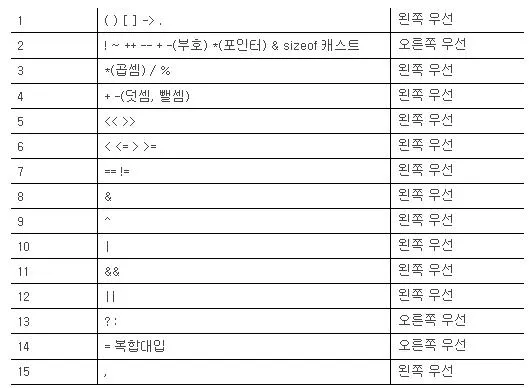

# C언어 기초

## Nov 2021

<details>
<summary>2021/11</summary>
<div markdown="1">

<details>
<summary>11/01</summary>
<div markdown="1">

### 21-11-01 
1. C언어의 정의
2. 기수법 / 2진수 ↔ 10진수 ↔ 16진수 변환 / bit, byte, word, double word (메모리 단위)
3. 변수 - 정수형, 실수형 / 메모리 주소 / 변수 이름 주의사항
4. 연산자 - 산술, 대입, 비트, 쉬프트 / 연산 우선 순위 / 2의 보수 / 정수 오버플로우
5. scanf
6. if / if ~ else
7. for / while / do ~ while

</div>
</details>

<details>
<summary>11/02</summary>
<div markdown="1">

### 21-11-02
1. switch, case
2. 형 변화(캐스팅), 부동 소수점, 정규화
3. 배열(Array), 소수(Prime Number), 상수(Constant)</br>
  ※ 배열의 원소에 접근할 때 **우리가 참조하는 원소의 위치가 배열의 크기 보다 작은지 확인**

  </br>3-1. 소수  
  1과 자신을 제외한 약수가 하나도 없는 수  
  >**※ 배열의 원소의 수를 변수 크기 지정 시 특정한 값이 들어있는 변수를 사용할 수 없다.**
  ``` c
  int total = 3;
  int arr[total];
  ```
  _위와 같이 사용시 에러 발생_

  </br>3-2. 상수  
  처음 정의 시 값이 바로 주어지고, 값의 변경이 불가능하다.  
  >**※ 배열의 크기를 상수로 지정할수 없다.**
  
  </br>3-3. 변수 및 배열을 초기화 하지 않고 사용 시 에러 발생  
  >예외)
  ```c
  int arr[3] = {1};
  →/* compiler */→
  int arr[3] = {1, 0, 0};
  ```
  >**※ 특별히 초기화 하지 않은 원소들에는 0이 자동으로 들어가게 된다.**

</div>
</details>

<details>
<summary>11/03</summary>
<div markdown="1">

### 21-11-03
1. 배열 연습문제(/src/modoocode)  
1-1. 입력받은 학생들의 성적은 내림차순으로 정렬  
<br>1-2. 입력받은 학생들의 성적을 막대 그래프로 표현 (해결 x)

</div>
</details>

<details>
<summary>11/04</summary>
<div markdown="1">

### 21-11-04
1. 다차원 배열
  - 2차원 배열
  - 3차원 이상의 고차원 배열

  </br>1-1. 2차원 배열
    ```c
    int arr[3][2];
    ```
    > 위 배열을 그림으로 보면 아래와 같다

|`arr[0]`|`arr[1]`|`arr[2]`|
|:---:|:---:|:---:|
|↓|↓|↓|
|`arr[0][0]`|`arr[1][0]`|`arr[2][0]`|
|`arr[0][1]`|`arr[1][1]`|`arr[2][1]`|

→ ```arr[m][n];``` 과 같이 배열을 선언한다면(m, n은 임의의 정수값), m × n 개의 변수를 가지는 배열을 선언한 것이다. 

- 2차원 배열이나 1차원 배열 모두 메모리 상에서 연속적으로 존재 (메모리는 항상 1차원)

|메모리|
|---|
|`arr[0][0]`|
|`arr[0][1]`|
|`arr[0][2]`|
|`arr[1][0]`|
|`arr[1][1]`|
|`arr[1][2]`|
|`arr[2][0]`|
|`arr[2][1]`|
|`arr[2][2]`|

- 하지만 2차원 배열을 생각할 때 해당 원소들이 아래 표처럼 2차원 공간상에 배치 되어 있다고 생각할 수 있다.

|`arr[0][0]` 1|`arr[0][1]` 2|`arr[0][2]` 3|
|---|---|---|
|`arr[1][0]` 4|`arr[1][1]` 5|`arr[1][2]` 6|
|`arr[0][1]` 7|`arr[1][1]` 8|`arr[2][2]` 9|

※ **일차원 배열은 한 개의 인덱스로 원소에 접근하는 것**이고, **이차원 배열은 두 개의 인덱스로 원소에 접근하는 것**이다.

</div>
</details>

<details>
<summary>11/05</summary>
<div markdown="1">

### 21-11-05
1. 2차원 배열 실습(/src/modoocode)
2. 배열 정의  
`int arr[2][3] = {1,2,3,4,5,6};`  
`int arr[2][3] = {{1,2,3},{4,5,6}};`  
`int arr[] = {1,2,3,4};` = 
`int arr[4] = {1,2,3,4};`
> 위와 같이 정의 가능하다.

`int arr[];`
>하지만 위와 같이 정의 하는것은 불가능하다. 위처럼 배열을 정의한다면 컴파일러는 우리가 어떠한 크기의 배열을 정의하고 싶은지 모르기 때문에 오류가 발생한다.

  2-1. 2차원 배열의 정의  
  `int arr[][3] = {4,5,6}, [7,8,9}};`
  >비어있는 대괄호 안은 '2'가 들어간다.

  `int arr[][2] = {1,2},{3,4},{5,6},{7}};`
  >배열 정의 시 `arr[][2]`라고 했기 때문에 무조건 원소가 2인 1차원 배열들이 생기게 된다. 즉 7이 속한 1차원 배열에는 원소가 한 개인 것이 아니라 마치 `arr[3] = {1}`고 해도 상관 없는 것 처럼 8번째 원소가 들어갈 자리를 비워 놓게 되어 틀린 문장이 아니다.

  `int arr[2][] = {{4,5,6},{7,8,9}}`
  >**다차원 배열의 경우 맨 앞의 크기를 제외한 나머지 크기들을 정확히 지정해줘야 오류가 발생하지 않는다.**

3. 3차원, 그 이후 차원의 배열들

- 3차원 배열(그 이후)의 정의는 2차원 배열과 거의 동일

>일차원 배열은 한 개의 값(x)으로 원소에 접근하는 것이고, 이차원 배열은 두 개의 값(x,y)으로 원소에 접근하는 것이다!  
->  
3차원 배열은 세 개의 값(x,y,z)로 원소에 접근한다.

</div>
</details>

<details>
<summary>11/06</summary>
<div markdown="1">

### 21-11-06
~~1. 포인터~~  
- 1차원 배열 기초 연습 문제(/src/CodeUp)

</div>
</details>

<details>
<summary>11/07</summary>
<div markdown="1">

### 21-11-07
- 일주일치 복습 및 내용 정리/이해

</div>
</details>

<details>
<summary>11/08</summary>
<div markdown="1">

### 21-11-08
- 2차원 배열 기초 연습 문제
(/src/CodeUp)

</div>
</details>

<details>
<summary>11/09</summary>
<div markdown="1">

### 21-11-09
- 포인터
  >포인터 : 메모리 상에 위치한 특정한 데이터의 (시작) **주소값**을 보관하는 변수

  - (포인터에 주소값이 저장되는 데이터의 형) *(포인터의 이름);

  `int *p;`

  - (포인터에 주소값이 저장되는 데이터의 형)* (포인터의 이름);

  `int* p;`

  -> 포인터 p는 int형 데이터의 주소값을 저장하는 변수

- & 연산자
  - 변수 a의 주소값을 알고 싶다면 `&a` 로 쓰면 된다.
  
  >& 연산자를 사용하여 특정한 데이터의 메모리 상의 주소값을 알 수 있다.

</div>
</details>

<details>
<summary>11/10</summary>
<div markdown="1">

### 21-11-10
- **포인터는 특정한 데이터의 주소값을 보관한다. 이 때 포인터는 주소값을 보관하는 데이터의 형에 *를 붙임으로써 정의되고, &연산자로 특정한 데이터의 메모리 상의 주소값을 알아올 수 있다.**
</br></br>
- \* 연산자
  - 주소값에서 해당 주소값에 대응되는 데이터를 가져오는 연산자
</br> -> '_나에게 저장된 주소값에 해당하는 데이터로 생각하세요'_

int 변수 a / 포인터 p
</br>-> 포인터 p에 변수 a의 주소값이 저장되어 있다면, **포인터 p는 변수 a를 가리킨다.** (_포인터 또한 엄연한 변수_이기 때문에 특정한 메모리 공간을 차지한다.)

- 포인터도 타입이 있다.
- 포인터도 변수이기 때문에 포인터에 들어간 주소값이 바뀔 수 있다.

</div>
</details>

<details>
<summary>11/11</summary>
<div markdown="1">

### 21-11-11
- 포인터는 특정한 데이터의 메모리 상의 (시작) 주소값을 보관하는 변수

- 상수 포인터
  - 상수: 어떠한 데이터를 상수로 만들기 위해 `const` 키워드를 붙이면 된다. </br> -> '이 데이터의 내용은 절대로 바뀔수 없다!'
  </br>→→ '절대로 바뀌지 않을 것 같은 값에는 무조건 `const` 키워드를 붙여주는 습관'을 가져야한다.  
</br>
- `const int *`의 의미는 `const int`형 변수를 가리키는게 아니라 `int`형 변수를 가리키는데, **그 값을 절대로 바꾸지 말라**라는 의미 이다.

</div>
</details>

<details>
<summary>11/12</summary>
<div markdown="1">

### 21-11-12
~~포인터 덧셈~~  
11-09 ~ 11-11 까지의 포인터 복습

</div>
</details>

<details>
<summary>11/13</summary>
<div markdown="1">

### 21-11-13
- 11-11 참조(상수 포인터 부분)

```c
/* 상수 포인터? */
#include <stdio.h>
int main() {
  int a;
  int b;
  const int* pa = &a;

  *pa = 3;  // 올바르지 않은 문장
  pa = &b;  // 올바른 문장
  return 0;
}
```

```c
const int* pa = &a;
// int* pa와 같이 정의해도 int *pa와 같음
```

- `const int*`는 `const int`형 변수를 가리키는 것이 아니라 `int`형 변수를 가리키는데, **그 값을 절대로 바꾸지 말라**는 의미이다.  
즉, `pa`는 어떠한 `int`형 변수를 가리키고 있는데 `const`가 붙었으므로 `pa`가 가리키는 변수의 값은 절대로 바뀌면 안된다.

→ `a` 자체는 변수이므로 값이 자유롭게 변경 될 수 있다.  
`pa`를 통해서 `a`를 간접적으로 가리킬 때에는 컴퓨터가 **'아, 내가 `const`인 변수를 가리키고 있구나'** 라고 생각하기 때문에(`const int*` 로 포인터를 정의했기때문) 값을 바꿀 수 없다.

</div>
</details>

<details>
<summary>11/14</summary>
<div markdown="1">

### 21-11-14
- [11-11](#21-11-11) / [11-13](#21-11-13) 참조

```c
/* 상수 포인터? */
#include <stdio.h>
int main() {
  int a;
  int b;
  int* const pa = &a;

  *pa = 3;  // 올바른 문장
  pa = &b;  // 올바르지 않은 문장

  return 0;
}
```

- 위 코드에서는 `const`키워드가 `int*`앞에 있는것이 아니라 `int*`와 `pa`사이에 놓이고 있다.

- 포인터에는 가리키는 데이터의 주소값, 즉 `a`의 주소값이 `pa`에 저장 된다. 따라서, 이 `pa`가 `const`라는 의미는 `pa`의 값이 절대로 바뀔 수 없다는 것인데, `pa`는 포인터가 가리키는 변수의 주소값이 들어 있으므로 `pa`가 처음에 가리키는것(`a`)말고 다른것은 절대로 건드릴 수 없다는 것이다.

```c
*pa = 3; //올바른 문장
```

- pa가 가리키는 값을 바꾸면 안된다는 말은 안했기 때문에 위 문장은 가능하다.

</div>
</details>

<details>
<summary>11/15</summary>
<div markdown="1">

### 21-11-15
- 포인터 덧셈, 뺄셈

```c
#include <stdio.h>
int main() {
  int a;
  int* pa = &a;

  printf("pa의 값: %p \n", pa);

  printf("(pa + 1)의 값 : %p \n", pa + 1); // 포인터의 덧셈

  printf("(pa - 1)의 값 : %p \n", pa - 1); // 포인터의 뺄셈

  return 0;
}
```

- int가 4바이트이기 때문에 pa + 1는 주소값에 4가 더해져서 출력된다.

- int가 아닌 char, double을 사용하더라도 그에 맞게 1바이트, 8바이트 더해지게 된다.

- 위 코드에서 뺄셈의 경우에도 4가 빠지게 된다.

※ C에서는 두 포인터끼리의 덧셈을 허용하지 않는다.  
-> 두 변수의 메모리 주소를 더해서 나오는 값은 이전에 포인터들이 가리키던 두 변수와 관계없는 메모리 속의 임의 지점이다.

- 배열과 포인터

  - 배열은 **변수가 여러개 모인 것으로 생각할 수 있다.**

  - 배열들의 각 원소는 메모리 상에 연속되게 놓인다.

  ```c
  int arr[10] = {1, 2, 3, 4, 5, 6, 7, 8, 9, 10};
  ```

  이라고 정의한다면  위 사진에서 볼 수 있듯, 메모리 상에 연속된 형태로 나타나게 된다. 한개의 원소는 int형 변수이기 때문에 4바이트를 차지하게 된다.

</div>
</details>

<details>
<summary>11/16</summary>
<div markdown="1">

### 21-11-16

~~배열과 포인터 2 (예정)~~
- 휴식일

</div>
</details>

<details>
<summary>11/17</summary>
<div markdown="1">

### 21-11-17
- 배열과 포인터2
  - 포인터로도 배열의 원소에 쉽게 접근할 수 있다.  
  -> 배열의 시작 부분을 가리키는 포인터를 정의한 뒤에 포인터에 1을 더하면 그 다음 원소를 가르킨다.

  - 포인터는 자신이 가리키는 데이터의 '형'의 크기를 곱한 만큼 덧셈을 수행하기 때문  

  ※ 되돌아보기: **배열의 각 원소는 하나의 변수로 생각할 수 있다.**

```c
#include <stdio.h>
int main() {
  int arr[10] = {1, 2, 3, 4, 5, 6, 7, 8, 9, 10};
  int* parr;

  parr = &arr[0];

  printf("arr[3] = %d , *(parr + 3) = %d \n", arr[3], *(parr + 3));
  return 0;
}
```
>*를 이용하여 원소들과 똑같은 역할 수행이 가능하다.

- 배열에서 배열의 이름은 배열의 첫 번째 원소의 주소값을 나타낸다.
이때, 배열의 이름이 배열의 첫 번째 원소를 가리키는 포인터는 ***아니다!***


</div>
</details>

<details>
<summary>11/18</summary>
<div markdown="1">

### 21-11-18
배열 = 배열 / 포인터 = 포인터  
-> 배열의 이름과 첫 번째 원소의 주소값은 엄밀히 다른 것이다.  

(`sizeof`사용 시 배열은 배열의 실제 크기가 나오는 반면, 포인터는 배열 자체 크기가 아닌 포인터의 크기를 알려줌)

- 배열의 이름이 `sizeof` 연산자나 주소값 연산자(`&`)와 사용될 때(예를 들어 `&arr`)의 경우를 제외하고는, **배열의 이름을 사용 시 암묵적으로 첫 번째 원소를 가리키는 포인터로 타입 변환된다.**

- [] 연산자?
  - ex) arr[3] = *(arr + 3)로 바뀌어서 처리됨.
  - 3[arr] -> *(3 + arr)로 바꿔짐.
   따라서, arr[3]과 동일한 결과를 출력한다.

- 포인터의 정의

```c
int* p;
int *p;
/*두 가지 모두 가능하나, 아래 형식을 권장함.*/

int *p, *q, *r; // 올바른 문장
int* p, q, r; // 틀린 문장

// p만 int를 가리키는 포인터, q, r은 평볌한 int형 변수가 된다.
```

</div>
</details>

<details>
<summary>11/19</summary>
<div markdown="1">

### 21-11-19
> 이전 내용
- 배열은 배열이고, 포인터는 포인터이다. 다만;
  - `sizeof`와 주소값 연산자와 함꼐 사용할 때를 제외하면, 배열의 이름은 첫 번째 원소를 가리킨다.
   - `arr[i]`와 같은 문장은 사실 컴파일러에 의해 `*(arr + i)`로 변환된다.

---

- 1차원 배열 가리키기

```c
#include <stdio.h>

int main() {
  int arr[3] = {1, 2, 3};
  int *parr;

  parr = arr; // parr = &arr[0]; 과 동일

  printf("arr[1] : %d \n", arr[1]);
  printf("parr[1] : %d \n", parr[1]);
  return 0;
}
```
---
```c
#include <stdio.h>
int main() {
  int arr[10] = {100, 98, 97, 95, 89, 76, 92, 96, 100, 99};

  int* parr = arr;
  int sum = 0;

  while (parr - arr <= 9) {
    sum += (*parr);
    parr++;
  }

  printf("내 시험 점수 평균 : %d \n", sum / 10);
  return 0;
}
```

※ 포인터 연산에서 1 증가 시킨다면, `parr`에 저장된 주소값에 1을 더하는것이 아니라 `1 *`(포인터가 가리키는 타입의 크기)가 더해진다.

- 여기서 `parr`을 따로 선언한 이유는 `arr`를 증가 시켜서 `*(arr)`로 접근 할 수 없기 때문이다. (아래 코드 참고)

```c
#include <stdio.h>
int main() {
  int arr[10] = {100, 98, 97, 95, 89, 76, 92, 96, 100, 99};

  arr++;  // 오류
  return 0;
}
```

- 배열의 이름이 첫 번째 원소를 가리키는 포인터로 타입 변경 된다고 했을 때, 단순히 배열의 첫 번째 원소를 가리키는 주소값 그 자체가 될 뿐이다.


- 따라서, `arr++`문장은 C컴파일러 입장에서 `(0x7fff1234)++;`를 수행한 것인데, 이는 말이 되지 않는 문장이다.

</div>
</details>

<details>
<summary>11/20</summary>
<div markdown="1">

### 21-11-20
- 포인터의 포인터
  - `int **p;` -> `int`를 가리키는 포인터를 가리키는 포인터

```c
// 예제
#include <stdio.h>
int main() {
  int a;
  int *pa;
  int **ppa;

  pa = &a;
  ppa = &pa;

  a = 3;

  printf("a: %d // *pa : %d // **ppa : %d \n", a, *pa, **ppa);
  //*pa = a, **ppa = *(*ppa) = *pa = a
  printf("&a: %p // pa : %p // *ppa : %p \n", &a, pa, *ppa);
  //pa = &a, *ppa = pa = &a
  printf("&pa: %p // ppa : %p \n", &pa, ppa);
  //ppa = &pa
}

// 같은 행에 있는 값들이 모두 같음
```

> 위 관계를 그림으로 나타내면 아래와 같다.


- 배열 이름의 주소값
  > **이전 내용**  
   배열 이름에 `sizeof`연산자와 주소값 연산자를 사용할 때 빼고는 전부 다 포인터로 암묵적 변환이 이루어진다.

```c
#include <stdio.h>

int main() {
  int arr[3] = {1, 2, 3};
  int (*parr)[3] = &arr;

  printf("arr[1] : %d \n", arr[1]);
  printf("parr[1] : %d \n", (*parr)[1]);
}
``` 

- `&arr`의 의미?  
  -> `arr`는 `int *`로 암묵적 변환된다고 했으니까 `&arr`는 `int **`가 되는것이 ***아니다!***  
암묵적 변환은 주소값 연산자가 왔을 때는 이루어지지 않는다.

-> `arr`는 **크기가 3인 배열**이기 때문에 `&arr`를 보관할 포인터는 **크기가 3인 배열을 가리키는 포인터**가 되어야 한다.

> ※ `parr`를 정의할 때 `*parr`를 꼭 `()`로 감싸야 한다. 괄호를 뺀다면 `int *parr[3]`과 같이 되어, 컴파일러가 `int *` 원소 3개를 가지는 배열을 정의한 것으로 오해하게 된다.

</div>
</details>

<details>
<summary>11/21~26</summary>
<div markdown="1">

### 21-11-21 ~ 21-11-26
  - 휴식(안경 파손, 수리 중)

</div>
</details>

<details>
<summary>11/27</summary>
<div markdown="1">

### 21-11-27
- 배열 이름의 주소값
  - 배열 이름에 `sizeof`연산자를 사용할 때 빼고는 전부 포인터로 암묵적 변환이 이루어진다.  
  _※ 암묵적 변환은 주소값 연산자가 왔을 때에는 이루어 지지 않는다._
  


</div>
</details>

<details>
<summary>11/28</summary>
<div markdown="1">

### 21-11-28
- 2차원 배열의 [] 연산자


</div>
</details>

<details>
<summary>11/29</summary>
<div markdown="1">

### 21-11-29
- 포인터의 형(type)을 결정짓는 두 가지 요소
  
- 포인터 배열


</div>
</details>

<details>
<summary>11/30</summary>
<div markdown="1">

### 21-11-30
- 포인터 복습


</div>
</details>

</div>
</details>

## Dec 2021

<details>
<summary>2021/12</summary>
<div markdown="1">

<details>
<summary>12/01</summary>
<div markdown="1">
  
### 21-12-01
- 포인터 복습
  
  
</div>
</details>

<details>
<summary>12/02</summary>
<div markdown="1">
  
### 21-12-02
- function (1)
  
  
</div>
</details>

<details>
<summary>12/03</summary>
<div markdown="1">
  
### 21-12-03
- function (1)
  - `main` 함수
  
  
</div>
</details>

<details>
<summary>12/04</summary>
<div markdown="1">

### 21-12-04
- function (2)
  
  
</div>
</details>

<details>
<summary>12/05</summary>
<div markdown="1">

### 21-12-05
- function (2)
  - 함수의 원형
  
  
</div>
</details>

<details>
<summary>12/06</summary>
<div markdown="1">

### 21-12-06
- function (3)
  
  
</div>
</details>

<details>
<summary>12/07</summary>
<div markdown="1">

### 21-12-07
- function (3)
  - 함수 포인터
  
  
</div>
</details>

<details>
<summary>12/08</summary>
<div markdown="1">

### 21-12-08
- function 복습
  
  
</div>
</details>

<details>
<summary>12/09</summary>
<div markdown="1">

### 21-12-09
- function 복습
  
  
</div>
</details>

<details>
<summary>12/10</summary>
<div markdown="1">

### 21-12-10
- 배열 + 포인터 + function
  
  
</div>
</details>

<details>
<summary>12/11~12</summary>
<div markdown="1">

### 21-12-11~12
- day off
  
  
</div>
</details>

<details>
<summary>12/13~12/31</summary>
<div markdown="1">

### 21-12-13 ~ 21-12-31
 - 사지방 고장
  
  
</div>
</details>

</div>
</details>


## Jan 2022

<details>
<summary>2022/01</summary>
<div markdown="1">

<details>
<summary>01/01</summary>
<div markdown="1">

- 배열

</div>
</details>

<details>
<summary>01/02</summary>
<div markdown="1">

- 배열 및 포인터

</div>
</details>

<details>
<summary>01/03</summary>
<div markdown="1">

- 배열 및 포인터

</div>
</details>

<details>
<summary>01/04</summary>
<div markdown="1">

- 포인터

</div>
</details>

<details>
<summary>01/05</summary>
<div markdown="1">

- 포인터

</div>
</details>

<details>
<summary>01/06</summary>
<div markdown="1">

- 포인터

</div>
</details>

<details>
<summary>01/07</summary>
<div markdown="1">

- 포인터

</div>
</details>

<details>
<summary>01/08</summary>
<div markdown="1">

- 포인터

</div>
</details>

<details>
<summary>01/09</summary>
<div markdown="1">

- function

</div>
</details>

<details>
<summary>01/10 ~ 01/16</summary>
<div markdown="1">

- 사지방 고장

</div>
</details>

</div>
</details>

## Feb 2022

<details>
<summary>2022/02</summary>
<div markdown="1">

<details>
<summary>02/25</summary>
<div markdown="1">

### 돌고돌아 포인터
- 메모리 상에 위치한 특정한 데이터의 (시작) 주소값을 보관하는 변수

- &연산자 - 피연산자의 주소값을 불러옴

- *연산자  
ex)
```c
p = &a;// 포인터 p는 변수 a를 가리킨다.
*p = 3; ( a = 3; ) //동일한 의미
```

</div>
</details>

<details>
<summary>02/27</summary>
<div markdown="1">

### 이어서 포인터
- 포인터의 타입  
ex)
```c
int a;
int *p; // 포인터가 가리키는 데이터 타입(여기서는 int형)
p = &a; // 메모리에서 차지하는 모든 주소들의 위치가 들어있는 것이 아니라 '시작주소'만 들어있다
*p = 4;
```
- 포인터는 **변수**다  
-> 포인터에 들어간 주소값이 바뀔 수 있다.


- 상수 포인터
> - 상수: `const`사용, 값 변경 절대 불가능  
> - 포인터에 const 사용 가능

</div>
</details>

<details>
<summary>02/28</summary>
<div markdown="1">

### 또 포인터
- `const int *pa = &a`
  > - `pa`가 가리키는 변수의 값은 절대로 바뀔 수 없다  
  > - `a` 자체는 값이 자유롭게 변경 될 수 있다

- `int *const pa = &a;`
  > - pa가 처음 가리키는 것(a의 주소값) 말고 다른 것은 절대 바꿀 수 없다.

- 포인터 덧셈
  - 포인터 + 정수(1,2...) = 포인터의 형(int, double..)만큼 주소값에 더해짐
  - _포인터끼리의 덧셈은 허용하지 않으나 뺄셈은 허용함_

- 포인터의 대입
  - 포인터의 형이 같다면 포인터를 대입할 수 있다.


- 배열과 포인터
  - 배열은 **변수가 여러개 모인 것으로 생각할 수 있다**
  - 배열들의 각 원소는 메모리 상에 연속되게 놓인다  
 > → 포인터로도 배열의 원소에 접근이 가능하다  
>배열의 시작 부분을 가리키는 포인터를 정의한 뒤에 포인터에 1을 더하면 그 다음 원소를 가리킨다. (데이터의 형에 따라 다름)

- **배열의 이름**은 **배열의 첫 번째 원소의 주소값**을 나타내고 있다
  > 배열의 이름이 배열의 첫 번째 원소를 가리키는 포인터는 _**아니다!**_

- 배열은 배열, 포인터는 포인터
  - sizeof 연산자를 통해 배열과 포인터의 크기를 알아냈을 때
    - 배열의 경우 그 배열의 **실제 크기**가 나온다.
    - 반면 포인터의 경우 단순히 포인터의 크기를 알려준다.

→ 배열의 이름과 첫 번째 원소의 주소값은 엄밀히 **다른 것**이다.
> C언어 상에서 배열의 이름이 sizeof 연산자나 주소값 연산자(&)와 사용될 경우를 제외하면, **배열의 이름을 사용시 암묵적으로 첫 번째 원소를 가리키는 포인터로 타입 변환되기 때문**

- [] 연산자
```c
/* [] 연산자 */
#include <stdio.h>
int main() {
  int arr[5] = {1, 2, 3, 4, 5};

  printf("a[3] : %d \n", arr[3]);
  printf("*(a+3) : %d \n", *(arr + 3));
  return 0;
}
```
- 
  - `arr`는 `+`연산자와 사용되기 때문에 첫 번째 원소를 가리키는 포인터로 변환됨
  - 위 코드에서 arr[3] = *(arr + 3)으로 변환되어 처리
  
    - 3[arr] = *(3 + a)도 가능

- 포인터 정의
  - `int* p;`
  - `int *p;`
  - 모두 사용 가능 하나 아래 형식을 더 많이 씀
    - `int *p, *q, *r;`과 같이 여러개의 변수를 선언
    - `int* p, q, r;` 이때, p만 int를 가리키는 포인터이고, q,r은 평범한 int형 변수

</div>
</details>

</div>
</details>


## Mar 2022

<details>
<summary>2022/03</summary>
<div markdown="1">

<details>
<summary>03/01</summary>
<div markdown="1">

### 마지막 포인터

- 복습
  -  `int arr[3];` 배열을 정의 `int *parr;` 포인터를 정의  
-> `parr = arr;` // parr = &arr[0];과 동일

- 1차원 배열 가리키기
  - 배열 arr를 선언하고, arr++를 하게 되면 오류가 생긴다. 그 이유는 배열의 이름이 첫 번째 원소를 가리키는 포인터로 타입 변경 된다고 했을 때, 이는 단순히 배열의 첫 번째 원소를 가리키는 주소값 그 자체가 될 뿐이기 때문이다.
  - 위 내용을 C컴파일러 입장에서 봤을 때, `(0x7fff1324)++;` 를 수행한것과 같다. 말이 되지 않는 문장이다.

- 포인터의 포인터
  - `int **p;` = int를 가리키는 포인터를 가리키는 포인터
 
- 배열 이름의 주소값
```c
int arr[3] = {1, 2, 3};
int (*parr)[3] = &arr;
```
- - arr는 크기가 3인 배열, &arr를 보관할 포인터는 **크기가 3인 배열을 가리키는 포인터**가 되어야한다.
  - parr을 정의할 때 *parr을 꼭 ()로 감싸야 하는데, 괄호를 빼면 `int *parr[3]` 로 되어 C컴파일러가 `int *` 원소 3개를 가지는 배열을 정의한 것으로 오해하게 된다.
  - parr은 _크기가 3인 배열을 가리키는 포인터_이기 때문에 배열을 직접 나타내기 위해서 *연산자를 통해 원래의 arr를 참조해야한다. (*parr)[1] = arr[1]
  - parr과 arr는 같은 값을 가진다.
    - arr와 parr 모두 배열의 첫 번째 원소의 주소값을 출력하나, 두 개의 타입은 다르다.  
    => arr자체가 어떤 메모리 공간에 존재하는 것이 아니기 때문이다.
  
</div>
</details>

<details>
<summary>03/02</summary>
<div markdown="1">

### 진짜 마지막 포인터..

- 2차원 배열의 []연산자
  - 1차원 배열이 여러 개 있다고 생각하면 된다.  
  => 컴퓨터 메모리 구조는 1차원이기 때문에 2차원 배열은 항상 선형으로 존재한다.
  - arr[0] = arr[0][0] / arr[1] = arr[1][0]  
  => 1차원 배열과 마찬가지로 sizeof나 주소값 연산자와 사용되지 않을 경우, **`arr[0]`은 `arr[0][0]`을 가리키는 포인터로 암묵적 타입 변환되고, `arr[1]`은 `arr[1][0]`을 가리키는 포인터로 타입 변환된다**
  > 1차원 배열 int arr[]에서 arr와 &arr[0]은 그 자체로 완전 다른 것이었던 것처럼, 2차원 배열 int arr[][]에서 arr[0]과 &arr[0][0] 또한 다르다. 다만 암묵적으로 타입 변환 시에 같은 것을 변환할 뿐이다.
  - sizeof 사용 시, 2차원 배열의 열의 개수를 계산할 수 있다.  
=> sizeof(arr[0])을 하면 0번째 행의 길이(총 열의 개수)가 나온다.  
=> 총 행의 개수는 전체 크기를 열의 크기로 나눈 것이다.
  - arr[0][0]의 형이 int이므로 arr[0]은 int *형이 되고, arr[1]또한 int *형이 된다.
  > 그러나 int*를 가리키는 포인터는 int**이나, **arr는 int **형이 되지 않는다.**  
  > int **형은 배열의 원소에 자유롭게 접근할 수 없다.

</div>
</details>

<details>
<summary>03/03</summary>
<div markdown="1">

### 끝나지 않는 포인터

- 포인터의 형(type)을 결정짓는 두 가지 요소
  - int arr[10] 이라는 배열에서 x번째 원소의 주소값을 알아내는 방법
    - 배열의 시작주소를 그냥 arr라 한다면 arr[x]의 주소값은 `arr + 4x` 로 나타낼 수 있다.
  - int arr[a][b] 라는 2차원 배열의 경우, arr[x][y]의 주소값 구하는 방법
    - 앞서 int arr[a][b]는 int arr[b] 짜리 배열이 메모리에 a개 존재하는 것이라고 설명했다. 따라서 arr[x][0]의 주소값은 x번째 int arr[b]짜리 배열이 된다.
    - arr[x][0]의 주소값은 `arr + 4bx` 가 된다.  arr[b] 배열의 크기는 4b이니까 x번째 배열의 시작주소는 4bx이기 때문
    - 따라서 arr[x][y]의 시작 주소값은 `arr + 4bx + 4y` 가 된다.
    - 여기서 중요한 점은 arr[x][y]의 주소값을 정확히 계산하기 위해서는 x, y 뿐만 아니라 b가 뭔지 알아야 한다.
    - 따라서 2차원 배열을 가리키는 포인터를 통해서 원소들을 정확히 접근하기 위해서는;
    1. 가리키는 원소의 크기 (여기서는 4)
    2. b의 값
    - 위 두 정보가 포인터의 타입에 명시되어 있어야 컴파일러가 원소에 올바르게 접근할 수 있다.


</div>
</details>

<details>
<summary>03/04</summary>
<div markdown="1">

### 진짜 진짜 마지막 포인터

- `int (*parr)[3]; // 배열의 형 (*포인터 이름)[2차원 배열의 열 개수]`
  - **parr은 크기가 3인 배열을 가리키는 포인터를 의미**
  - 1차원 배열에서 배열의 이름이 첫 번째 원소를 가리키는 포인터로 타입 변환이 된 것처럼, 2차원 배열에서 배열의 이름이 첫번째 **행**을 가리키는 포인터로 타입 변환이 되어야 한다. 이때, 첫 번째 행은 크기가 3인 1차원 배열이다.

- 포인터 배열
  - 배열 포인터는 배열을 가리키는 포인터
  - 포인터 배열은 포인터들을 모아놓은 배열
  > 용어는 언제나 뒷부분이 진짜라고 생각하면 된다. 즉, **포인터 배열은 배열이고, 배열 포인터는 포인터이다.**
  - 배열의 형을 `int*` 로도 할 수 있다. 즉, `int*` 배열에서 각각의 원소를 포인터로 취급할 수 있다.
```c
arr[0] = &a;
arr[1] = &b;
arr[2] = &c;
```
- - 위 문장에서 각각의 원소는 int형 변수 a, b, c를 가리키게 된다.
  - arr[0]에는 변수 a의 주소가, arr[1]에는 변수 b의 주소, arr[2]에는 변수 c의 주소가 각각 들어간다.

</div>
</details>

<details>
<summary>03/05</summary>
<div markdown="1">

### 함수 Function

- 함수의 시작
  - 함수의 정의(definition)
    - `int print() {}`
    1. 위 함수는 int형의 정보를 반환한다. (return)
    2. 함수의 이름뒤에 () 꼭 붙여야 한다.
    3. 함수의 이름 역시 변수의 이름 조건과 동일하다.
  - `{}`부분은 함수의 **몸체(body)**라고 부른다.
  - 함수를 불러내는 방법 (보통 **호출한다(call)**라고 표현함)
    
  - 함수의 종료는 두 가지 형태로 있을 수 있다.
    1. 반환이 되어 종료를 하게 된다.
    2. 함수의 끝 부분까지 실행하여 종료되는 것이다.
  - 한가지 중요한 사실은 return을 실행면 함수는 무조건 종료되어 함수를 호출하였던 부분으로 돌아간다는 점이다.

- 메인(main) 함수
  - 메인 함수가 리턴하는 데이터는 운영체제가 받아들인다.
  - 정상 종료 시 0 리턴, 비정상 종료 시 1 리턴

- 함수의 인자
  - 각 함수는 별개의 함수이기 때문에 각각의 함수에서 쓰이는 변수들을 사용할 수 없다.
  - **인자(argument, 혹은 매개변수(parameter))**
  - s함수를 호출할 때, s함수 안에서 정의된 avg라는 변수에 `매개변수(parameter)`의 값을 전달하겠다. -> `s(parameter);`
  - 호출자(caller), 함수를 호출하는 문장
    1. 각 함수 내부에서 선언된 변수들은 이름은 같지만 **서로 다른 변수** 이고, 메모리 상의 **다른 위치**를 점유하고 있다.
    2. **값**이 전달 된다.
    3. main, b 함수가 있을 때, b에서 변수의 값을 아무리 바꿔도 main함수의 변수에는 전혀 영향을 주지 않는다. 왜냐하면 b함수의 변수는 단지 **main 함수의 변수와 같은 값을 가진 채로 초기화된 메모리 상의 또다른 변수**이기 때문이다.

- 다른 함수에서 정의된 변수의 값을 수정하는 함수는 포인터를 이용하면 된다.

</div>
</details>

<details>
<summary>03/06</summary>
<div markdown="1">

### Function(1) 문제 풀기
[function(1) prob.1.c](https://github.com/kou466/study/blob/main/src/modoocode/MagicBox.c)  
[function(1) Prob.2.c](https://github.com/kou466/study/blob/main/src/modoocode/function(1)%20Prob.2.c)  
[function(1) Prob.3.c](https://github.com/kou466/study/blob/main/src/modoocode/function(1)%20Prob.3.c)  
[function(1) Prob.4.c](https://github.com/kou466/study/blob/main/src/modoocode/function(1)%20Prob.4.c)  

</div>
</details>

<details>
<summary>03/07</summary>
<div markdown="1">

### 함수 Function 2

- 포인터 복습
  - 특정한 변수의 메모리 상의 주소값을 저장하는 변수
  - int형 변수의 주소값을 저장하면 int*
  - char형 변수는 char*
  - 단항 연산자 *를 이용하여 자신이 가리키는 변수를 지칭할 수 있다.
  - & 연산자를 이용하여 특정한 변수의 조건을 알아낼 수 있다.


- 포인터로 받는 인자
```c
/* 드디어 써먹는 포인터 */
#include <stdio.h>
int change_val(int *pi) { // pi는 i의 주소값을 가짐
  printf("----- chage_val 함수 안에서 -----\n");
  printf("pi 의 값 : %p \n", pi);
  printf("pi 가 가리키는 것의 값 : %d \n", *pi);
  // * 연산자 : '내가 가지는 주소값에 해당하는 변수를 의미해라' -> *pi는 pi가 가리키는 i를 의미함

  *pi = 3; // pi가 가리키고 있는 변수(i)의 값을 3으로 변경

  printf("----- change_val 함수 끝~~ -----\n");
  return 0;
}
int main() {
  int i = 0;

  printf("i 변수의 주소값 : %p \n", &i);
  printf("호출 이전 i 의 값 : %d \n", i);
  change_val(&i); // i라는 변수의 '주소값'을 인자로 전달
  printf("호출 이후 i 의 값 : %d \n", i);

  return 0;
}
```
> **어떠한 함수가 특정한 타입의 변수/배열의 값을 바꾸려면 함수의 인자는 반드시 그 타입을 가리키는 포인터를 이용해야 한다**

- 함수의 원형(prototype)
  - 소스 코드의 제일 윗 부분에 함수의 원형을 추가
  > 대부분 함수를 main함수의 뒤에 정의하고 원형을 앞에 추가하는 것을 선호함


- 배열을 인자로 받기
```c
// 배열을 인자로 받아 그 배열의 각 원소의 값을 1씩 증가시키는 함수

#include <stdio.h>

int add_number(int *parr); // 1차원 배열을 가리키는 포인터는 int* 형 -> *parr은 arr를 가리킴
int main() {
  int arr[3];
  int i;

  /* 사용자로 부터 3 개의 원소를 입력 받는다. */
  for (i = 0; i < 3; i++) {
    scanf("%d", &arr[i]);
  }

  add_number(arr); // arr는 배열의 시작 주소 값을 가지고 있다. arr = &arr[0]

  printf("배열의 각 원소 : %d, %d, %d", arr[0], arr[1], arr[2]);

  return 0;
}
int add_number(int *parr) {
  int i;
  for (i = 0; i < 3; i++) {
    parr[i]++; 
  }
  return 0;
}
```
- Function(2) 문제 풀기

</div>
</details>

<details>
<summary>03/08</summary>
<div markdown="1">

### 함수 Function 3

- 복습
  - 어떠한 함수가 특정한 타입의 변수/배열의 값을 바꾸려면 함수의 인자는 반드시 특정한 타입을 가리키는 포인터 형을 이용해야 한다.


- 더블 포인터 인자
  - int* 타입을 가리키는 포인터의 타입은 int** 이다.
```c
/* 눈 돌아가는 예제. 포인터가 가리키는 변수를 서로 바꾼다.  */
#include <stdio.h>

int pswap(int **pa, int **pb);
int main() {
  int a, b;
  int *pa, *pb;

  pa = &a;
  pb = &b;

  printf("pa 가 가리키는 변수의 주소값 : %p \n", pa);
  printf("pa 의 주소값 : %p \n \n", &pa);
  printf("pb 가 가리키는 변수의 주소값 : %p \n", pb);
  printf("pb 의 주소값 : %p \n", &pb);

  printf(" ------------- 호출 -------------- \n");
  pswap(&pa, &pb);
  printf(" ------------- 호출끝 -------------- \n");

  printf("pa 가 가리키는 변수의 주소값 : %p \n", pa);
  printf("pa 의 주소값 : %p \n \n", &pa);
  printf("pb 가 가리키는 변수의 주소값 : %p \n", pb);
  printf("pb 의 주소값 : %p \n", &pb);
  return 0;
}
int pswap(int **ppa, int **ppb) {
  int *temp = *ppa;

  printf("ppa 가 가리키는 변수의 주소값 : %p \n", ppa);
  printf("ppb 가 가리키는 변수의 주소값 : %p \n", ppb);

  *ppa = *ppb;
  *ppb = temp;

  return 0;
}
```
- 위 코드 이해하기

  ---
- 더블 포인터 복습하기
  - **더블 포인터는 싱글 포인터의 주소 값을 저장하기 위한 포인터이다.**
```c
#include <stdio.h>

int main()
{
    int *numPtr1;     // 단일 포인터 선언
    int **numPtr2;    // 이중 포인터 선언
    int num1 = 10;

    numPtr1 = &num1;    // num1의 메모리 주소 저장 

    numPtr2 = &numPtr1; // numPtr1의 메모리 주소 저장

    printf("%d\n", **numPtr2);    // 20: 포인터를 두 번 역참조하여 num1의 메모리 주소에 접근

    return 0;
}
```
- 포인터도 실제로는 변수이기 때문에 메모리 주소를 구할 수 있다.

  하지만 포인터의 메모리 주소는 일반 포인터에 저장할 수 없고, `int **numPtr2;` 처럼 이중 포인터에 저장 해야 한다.
- 여기서 이중 포인터 numPtr2를 끝까지 따라가서 실제 값을 가져오려면 *변수 앞에 역참조 연산자를 두 번 사용하면 된다.*

  즉, 역참조를 두 번 하므로 numPtr2 ← numPtr1 ← num1 과 같은 모양이 되고 num1 의 값을 가져올 수 있다.

> 위 코드를 그림으로 보면 아래와 같다.


</div>
</details>

<details>
<summary>03/09</summary>
<div markdown="1">

### 함수 Function 3 및 어제자 복습

- 2차원 배열을 인자로 받는 함수
```c
/* 2 차원 배열의 각 원소를 1 씩 증가시키는 함수 */
#include <stdio.h>
/* 열의 개수가 2 개인 이차원 배열과, 총 행의 수를 인자로 받는다. */
int add1_element(int (*arr)[2], int row);
// 열의 개수가 2개인 2차원 배열을 가리키는 포인터, 함수의 행의 수를 받는 인자

int main() {
  int arr[3][2];
  int i, j;

  for (i = 0; i < 3; i++) {
    for (j = 0; j < 2; j++) {
      scanf("%d", &arr[i][j]);
    }
  }

  add1_element(arr, 3);

  for (i = 0; i < 3; i++) {
    for (j = 0; j < 2; j++) {
      printf("arr[%d][%d] : %d \n", i, j, arr[i][j]);
    }
  }
  return 0;
}
int add1_element(int (*arr)[2], int row) {
  int i, j;
  for (i = 0; i < row; i++) {
    for (j = 0; j < 2; j++) {
      arr[i][j]++;
    }
  }

  return 0;
}
```
- 인자를 받는 것이 어렵게 느껴지기에, **함수의 인자의 경우에만** 아래 형태로 표현이 가능하다.
```c
int add1_element(int (*arr)[2], int row);
/*================동일=================*/
int add1_element(int arr[][2], int row);
```
> 만약 `int parr[][3] = arr;`의 문장을 이용했다면 컴퓨터는 parr을 '열의 개수가 3개이고 행의 개수는 정해지지 않은 배열'이라고 생각하여 오류를 내게된다.

- 다차원 배열의 인자도 정의 가능하다.
```c
int multi(int (*arr)[3][2][5]) {
  arr[1][1][1][1] = 1;
  return 0;
}
/*=============혹은=============*/
int multi(int arr[][3][2][5]) {
  arr[1][1][1][1] = 1;
  return 0;
}
```

- 상수인 인자
  - 상수로 인자를 받아들이는 경우 대부분은 함수를 호출해도 그 인자의 값이 바뀌지 않는 경우에 자주 사용한다.
  - ex) `int read_val(const int val);`
 
- 함수 포인터
  - 메모리 상에 올라간 함수의 시작 주소를 가리키는 역할을 하게 된다.
  - 함수 포인터가 함수를 가리키기 위해서는 그 함수의 시작 주소값을 알아야 하는데, 배열과 마찬가지로 **함수의 이름이 바로 함수의 시작 주소값**이다.
```c
/* 함수 포인터 */
#include <stdio.h>

int max(int a, int b);
int main() {
  int a, b;
  int (*pmax)(int, int); // 함수 포인터 pmax의 정의
  pmax = max; // max함수와 pmax의 정의가 일치하므로, max함수의 시작 주소값을 pmax에 대입할 수 있다.

  scanf("%d %d", &a, &b);
  printf("max(a,b) : %d \n", max(a, b));
  printf("pmax(a,b) : %d \n", pmax(a, b));
  // pmax는 max함수를 가리키므로 pmax를 통해 max함수가 할 수 있었던 모든 작업들을 할 수 있다.
  
  return 0;
}
int max(int a, int b) {
  if (a > b)
    return a;
  else
    return b;

  return 0;
}
```
- - 함수 포인터의 정의
    - 함수 포인터의 일반적인 정의
  >(함수의 리턴형) (*포인터 이름) (첫번째 인자 타입, 두번째 인자 타입, ...)  
  >만일 인자가 없다면 괄호 안을 비워두면 된다. 즉, int (*a)() 와 같이 하면 된다.

  - max함수와 donothing함수가 함수 포인터 pfunc와 정의가 일치하면 pfunc는 *두 개의 함수를 가리킬 수 있다.*
  - 인자의 형이 무엇인지 알기 힘든 경우가 있다.
    - ex) `int increase(int (*arr)[3], int row);`
    - 특정한 타입의 인자를 판별하는 일은 단순히 변수의 이름만을 빼버리면 된다.
    - 첫 번째 인자의 형은 `int (*)[3]`
    - 두 번째 인자의 형은 `int`
    - 즉 increase 함수를 가리키는 함수 포인터의 원형은 아래와 같다.
    - `int (*pfunc)(int (*)[3], int);`

</div>
</details>

<details>
<summary>03/10-11</summary>
<div markdown="1">

### 문제

- [function(3) prob.1.c](https://github.com/kou466/study/blob/main/src/modoocode/function(3)%20prob.1.c)  

</div>
</details>

<details>
<summary>03/13-14</summary>
<div markdown="1">
  
### 문자열 String

- 컴퓨터는 문자열을 문자들의 배열, 즉 char 배열에 저장한다.

- 널 - 종료 문자열 (Null-terminated string)
  - `char s[3];` 이렇게 문자열 s를 정의했을 때 불편함이 생긴다. 문자열을 이용할 때 마다 문자열의 길이를 알아야 하기 때문이다.
  - 위에 대한 대안으로 문자열의 끝에 **여기 까지가 문자열이다** 라고 알려주는 종료 문자를 넣은것이다.
  - 종료 문자는 아스키 값이 0이고, '\0'라고 나타낸다. 이때, 문자 '0'과 헷갈려서는 안된다.(문자 '0'은 아스키값이 48임)
  - 이 종료 문자를 가리켜서 널(Null)이라고 부른다.
 
  - Null문자가 들어갈 공간이 있어야 하기 때문에 3글자라도 배열은 4칸이 필요하다.

```c
// null_1부터 null_3까지 모두 동일하다.
char null_1 = '\0';
char null_2 = 0;
char null_3 = (char)NULL;

// sentence_4에서 Null값을 넣어줘야 하기때문에 문자의 개수보다 배열의 크기를 1 크게 해야한다.
char sentence_1[4] = {'P', 's', 'i', '\0'};
  char sentence_2[4] = {'P', 's', 'i', 0};
  char sentence_3[4] = {'P', 's', 'i', (char)NULL};
  char sentence_4[4] = {"Psi"};
  // sentence_4는 배열의 시작점을 가리키고 있으니 출력문에 바로 사용 가능하다.
  printf("sentence_4 : %s \n", sentence_4);
```
|`""`|`''`|
|---|---|
|큰 따옴표는 문자열 (한 개 이상의 문자)를 지정할 때 사용된다. </br> 예) "abd", "asdfasdf", "sentence", "a" 등|작은 따옴표는 한 개의 문자를 지정할 때 사용된다. </br> 예) 'a', 'b', '\0' (틀린 표현: 'abc', 'ab', 'cd' 등|

```c
/* 포인터 간단 복습 */
#include <stdio.h>
int main() {
  char word[30] = {"long sentence"};
  char *str = word;

  printf("%s \n", str);

  return 0;
}
```

- char*를 이용해서 char 배열을 가리킬 수 있기에, str이라는 char를 가리키는 포인터가 배열 word를 가리키고 있다.

- 문자열 바꾸기도 가능하다.
  - `char word[] = {"long sentence"};` 이 문장에서 '[]' 안 원소의 개수는 컴파일러가 알아서 원소의 수를 세어넣는다.
  - 이때 `word[0] = 'a';` 와 같은 식으로 문자열을 바꿀 수 있다.

</div>
</details>

<details>
<summary>03/18</summary>
<div markdown="1">  

### 문자열 String (1)

- 특정 문자열에 들어있는 문자의 개수를 세는 법
```c
#include <stdio.h>
int str_length(char *str);
int main() {
  char str[] = {"What is your name?"};

  printf("이 문자열의 길이 : %d \n", str_length(str));

  return 0;
}
int str_length(char *str) {
  int i = 0;
  while (str[i]) {
    i++;
  }

  return i;
}
```
> 일차원 배열을 가리키는 포인터는 `(그 배열의 형)*`

- - `str_length`라는 함수에서 while문의 조건 부분을 보면 str[i]가 0이 될때 까지 i의 값을 계속 증가 시킨다고 되어있다.
  - 문자열에서 0이 되는 순간은 NULL문자일때이다. 즉, 문자열의 끝 부분에 도달했을 때 0이 되는 것이기 때문에 i에는 맨 마지막의 NULL문자를 제외한 나머지 문자들의 총 개수가 된다.


- 문자열 입력받기
```c
/* 문자열 입력 */
#include <stdio.h>
int main() {
  char words[30]; // 최대 29글자 까지 저장할 수 있는 문자 배열 : 마지막에 NULL이 들어가기 때문에 30자가 아님

  printf("30 자 이내의 문자열을 입력해주세요! : ");
  scanf("%s", words);

  printf("문자열 : %s \n", words);

  return 0;
}
```
- - 배열(char words[30];)또한 scanf로 입력을 받는데 하나의 문자는 `%c`, 문자열일 경우 `%s`를 통해 받는다. 
  - scanf를 사용했을 경우 `&`를 이용해서 주소값을 전달하지 않고 배열의 이름 자체가 배열을 가리키는 포인터이기 때문에 &words가 아닌 그냥 words로 써야한다.

</div>
</details>

<details>
<summary>03/19</summary>
<div markdown="1">  

### 문자열 String (1)

- 문제 풀이

</div>
</details>

<details>
<summary>03/22</summary>
<div markdown="1">  

### 문자열 String (2)

- 버퍼(stdin)에 대한 이해
  - **버퍼(buffer)**
```c
/* 이상한 scanf */
#include <stdio.h>
int main() {
  int num;
  char c;

  printf("숫자를 입력하세요 : ");
  scanf("%d", &num);

  printf("문자를 입력하세요 : ");
  scanf("%c", &c);
  return 0;
}
```
- - 수 많은 버퍼 중에서도 키보드의 입력을 처리하는 버퍼는 입력 버퍼, 혹은 stdin(입력 스트림)이라 부르는 것이다.
  - 즉, 우리가 키보드로 치는 모든 정보는 일시적으로 `stdin`에 저장되었다가 나중에 입력이 종료되면 한번에 처리하게 된다.
  - 컴퓨터에서 우리가 입력을 종료했다는것을 알 수 있는 방법은 엔터(`\n`, 개행문자)를 이용하여 '입력을 종료했으니 버퍼에 있는 내용을 사용하라'는 의미로 받아들인다.
  - 그런데 컴퓨터는 `\n`까지 버퍼에 저장하는데, scanf함수에서 stdin으로부터 숫자를 얻어온다.

</div>
</details>

<details>
<summary>03/24</summary>
<div markdown="1">  

### 문자열 String (2)

- 버퍼 및 scanf에 대한 고질적인 문제


</div>
</details>

<details>
<summary>03/28</summary>
<div markdown="1">  
  
### 번외 - 디버깅 Debugging 1

- 디버깅(Debugging)?
  - 컴퓨터에 오류가 생기면 버그(bug)가 생겼다고들 한다. 왜 bug일까?
    - 1940년 그레이스 호퍼(Grace Hopper)라는 컴퓨터 과학자는 하버드 대학교 MK.Ⅱ 컴퓨터를 작동 시키던 도중 연산에 문제가 생겨 원인을 분석하다가 컴퓨터에 나방이 들어가 문제를 일으켰다는 것을 알게 되었다. 그녀는 이 나방을 꺼내고 곤충을 잡았다 라고 해서 디버그(Debug)했다고 기록했다.
  - 이 일로 인해 컴퓨터에 발생한 문제를 '버그', 이를 고치는 일을 '디버그'라고 부르게 되었다.

</div>
</details>

<details>
<summary>03/29</summary>
<div markdown="1">  

### 번외 - 디버깅 Debugging 2

- 디버깅은 C 프로그래밍을 배우면서 꼭 필요한 스킬이다. 적절한 디버깅을 통해 문제를 찾아낼 수 있기 때문이다.
```c
#include <stdio.h>
int main() {
  char a, b, c;
  a = 100;
  b = 300;
  c = a + b;

  printf("%d + %d = %d \n", a, b, c);
  return 0;
}
```
- 위 코드의 실행 결과는 `100 + 44 = -112`로 출력된다. 이상하지 않은가? 이때 사용하는 것이 바로 디버깅이다.
    - VS기준으로 F10을 누르면 코드를 분석하는 디버깅 모드로 들어간다. 여기서 필요한 부분은 코드부분의 **노란 화살표**와 아래에 있는 **조사식** 부분이다.
    - 앞서 말했듯, 디버깅을 하는 이유는 버그를 찾아내기 위함이다. 그런데 버그를 찾지 못하는 것은 컴퓨터의 연산속도가 매우 빠르기 때문인데, 디버깅을 할 때에는 사용자로 하여금 각 문장이 실행되는 과정을 천천히 살펴볼 수 있기에 어느 부분에서 문제가 발생한 것인지를 알 수 있다.

</div>
</details>

<details>
<summary>03/30</summary>
<div markdown="1">  

### 번외 - 디버깅 Debugging 3

> 위 그림을 참고하여 아래 내용을 읽을것

- 어제 내용에서 디버깅에 필요한 부분은 **노란 화살표와 조사식** 이라고 했다.
  - 노란 화살표는 '내가 다음에 실행한 코드'를 가리키는 역할을 한다.
  - 조사식은 내가 값을 보고 싶은 식을 써넣으면 되는데, 예를 들어 변수 a의 값을 보고 싶다면 a를 치고, a + b의 값을 보고 싶다면 a + b의 값을 치면 된다.
  - 하지만 위 노란 화살표가 {를 가리킨다면 다음 실행할 문장이 {이므로 `char a,b,c;`는 실행조차 되지 않아 변수가 정의되어 있는지 모른다. 그렇기 때문에 다음 문장을 실행하기 위해 F10을 누르면 된다.
  - 조사식에서 `a는 100 'd'`, `b는 44','`,`c는 -112'?'`로 나타나게 되는데, -112에 해당하는 아스키 문자가 ?여서 출력된것이 아닌 아스키 표에 해당하지 않는 수이기 때문에 알 수 없음의 의미로 ?가 출력된 것이다.
  - c = a + b;에서 c = -112가 나온 이유는 char의 범위가 128까지이기 때문이다.

- 우리가 디버깅을 하지 않았다고 해도 위 예제에서는 char 범위 때문에 그렇다는 것을 알 수 있었겠지만, 실제로 우리가 만들 프로그램은 훨씬 복잡하기에 이런 디버깅 과정을 거쳐 문제가 생긴 부분을 찾아 낼 수 있다.
 
</div>
</details>

<details>
<summary>03/31</summary>
<div markdown="1">

### String (2)


</div>
</details>

</div>
</details>

## Apr 2022

<details>
<summary>2022/04</summary>
<div markdown="1">

<details>
<summary>04/01</summary>
<div markdown="1">

### String (2)


</div>
</details>

<details>
<summary>04/02</summary>
<div markdown="1">

### String (2) - ??


</div>
</details>

<details>
<summary>04/03</summary>
<div markdown="1">

### String (3)

- 문자열 리터럴(literal)에 대해
```c
/* 문자열 */
#include <stdio.h>
int main() {
  char str[] = "sentence";
  char *pstr = "sentence";

  printf("str : %s \n", str);
  printf("pstr : %s \n", pstr);

  return 0;
}
```
- 위 코드에서 첫 번째 문장은 sentence라는 문자열을 str이라는 배열에 집어넣었지만, 두 번째 문장은 무언가 이상한 점을 발견할 수 있다.
  - *"sentence"* 는 문자열이지, 어떠한 변수의 주소값이 아니다.
  - pstr은 char을 가리키는 포인터이므로 char형 변수의 주소값이 들어가야 하는데 *"sentence"* 를 특정한 주소값처럼 사용하고 있다.
  - 그런데, *"sentence"* 는 *"sentence"* 라는 문자열이 저장된 주소값(시작주소값)을 말한다.

```c
/* 문자열 */
#include <stdio.h>
int main() {
  char str[] = "hello";
  char *pstr = "goodbye";

  str[1] = 'a';
  pstr[1] = 'a';

  return 0;
}
```

- 위 코드를 실행하게 되면 오류가 발생하는데, `pstr[1] = 'a';` 를 주석 처리한 후 다시 실행하면 제대로 실행된다.
  - 맨 위 예제에서 pstr의 값을 읽기만 했을때는 정상적으로 실행되었지만 아래에서 `pstr[1] = 'a';` 를 통해 pstr의 값을 변경하였을 때 오류가 출력된 것으로 보아 마치 *상수처럼 컴퓨터에서 값을 변경하도록 허락하지 않는 것 같다.*
---
### 리터럴(literal)

- 프로그래밍 언어에서 **리터럴(literal)** 이란, 소스 코드 상에서 고정된 값을 가지는 것을 일컫는데, C언어의 경우 큰 따옴표( " )로 묶인 것들을 **문자열 리터럴(string literal)** 이라 부른다.

```c
char *pstr = "goodbye";
printf("why so serious?");
scanf("%c", str[0]);
```

- 위 3개의 문장에서 문자열 리터럴은 `goodbye, why so serious, %c` 모두 리터럴이다.
  - 컴퓨터에서는 프로그램을 실행하면 메모리 상의 특별한 곳에 이러한 리터럴들을 따로 보관하는 공간이 생긴다.
  > 추가적으로 설명하자면, 프로그램이 실행되서 메모리에 로드되면, 5 가지 종류의 영역(text segment, data segment, bss segment, heap, stack) 이 존재한다. 이 때, 텍스트 세그먼트(text segment) 에 프로그램 코드와 상수, 리터럴 등이 여기서 정의된다. 왜냐하면 텍스트 세그먼트에 있는 내용들은 읽기만 가능하기 때문이다. 물론 이 사실은 컴파일러 구현에 따라, 사용하는 운영체제 환경에 따라서 다를 수 있다.
  - 따라서 `char *pstr = "goodbye";` 를 실행하게 되면 컴퓨터는 *"goodbye의 시작 주소값을 가져와서 pstr에 대입해라"* 는 작업을 실행하게 된다.
  - pstr은 *"goodbye"* 라는 리터럴을 가리키고 printf("%s", pstr)을 했을 때 goodbye를 출력할 수 있게 된 것이다.

- 위에서 리터럴은 소스 코드 상에서 고정된 값을 가지는 것들이라고 했다. 즉, 실제 프로그램 실행 중에서도 리터럴의 값은 절대로 변경되어서는 안된다는 것이다.
  - 만일 hello라는 리터럴의 값을 실수로 hi로 변경하였다면, 사용자는 분명히 str에 hello라는 값을 넣으라고 명령했지만 hi가 들어가 큰 문제를 야기할 수 있다.
  - 따라서 리터럴이 보관되는 곳은 **오직 읽기만 가능한 곳** 이 된다. 만일 이곳을 함부로 변경하려고 하는 시도가 있다면 바로 프로그램이 강제로 종료되게 되는데, *이 또한 사용하는 운영체제, 환경에 따라 다르다.*

- 그렇기에 `char str[] = "hello";`를 했다면 str에 hello가 들어가고 `printf("why so serious?");` 를 했다면 화면에 why so serious가 출력될 거라고 보장할 수 있는 것이다.
  - 이 모든 문자열들이 *"문자열 리터럴"* 이라는 이름하에 메모리 상의 특별한 공간에서 보호 받고 있기 때문이다.

```c
char *pstr = "goodbye";
pstr[1] = 'a';
```

- 위 코드를 다시 살펴보면, goodbye 역시 문자열 리터럴이기 때문에 메모리 상의 공간에 저장된다. 그런데 이 곳은 오직 읽기만 가능한 곳이므로 쓰기( `pstr[1] = 'a';` )를 통해 *"리터럴 goodbye"* 의 값을 변경하려고 했기에 오류를 뿜게 되는 것이다.

```c
char str[] = "hello";
```

- 위 코드에서 *"hello"* 는 리터럴이라고 부르기 애매한데, 위 배열의 정의는 컴파일러에서 아래와 같이 해석되기 때문이다.

```c
char str[] = {'h', 'e', 'l', 'l', 'o', '\0'};
```

- 그냥 str이라는 배열에 hello라는 문자열을 복사하게 될 뿐이다. 그리고 위 배열은 텍스트 세그먼트가 아니라 스택(stack)이라는 메모리 수정이 가능한 영역에 정의가 되기에 str안의 문자열들은 수정이 가능하다.

> __참고적으로 VS 2017 이상에서는 리터럴을 char* 가 가리킬 수 없다. 반드시 const char* 가 가리켜야 하며, 덕분에 리터럴을 수정하는 괴랄한 짓을 컴파일 단에서 막을 수 있다.__

</div>
</details>

<details>
<summary>04/04</summary>
<div markdown="1">

### String (3)

- 문자열 가지고 놀기
  - C언어에서 문자열을 다루는 일은 생각보다 불편한 일이다.
  - int형 변수의 경우
```c
int i, j = 0;
i = j + 3;
```
- 위 처럼 값을 더하는 것이 가능하지만 문자열의 경우
```c
char str1[] = {"abc"};
char str2[] = {"def"};
str1 = str1 + str2;
```
- 위처럼 한다고 해서 str1이 "abcdef"가 되는 것이 아니다. str1 + str2는 각 배열의 주소값을 더하는 것인데, 배열의 이름은 포인터 상수이기 때문에 대입 연산 수행 시 오류가 발생한다.
- 또한, 다음과 같이 문자열을 비교하는 것도 불가능하다. `if (str1 == str2)`
- 위 문장의 의미는 "str1의 문자열이 들어있는 메모리 상의 (시작)주소와 str2의 문자열이 들어있는 메모리 상의 (시작)주소값을 비교해라" 라는 의미의 문장이기 때문이다. 따라서 우리가 원하던 기능이 실행 될 수 없으며, 다음과 같은 문장 또한 원하는 대로 실행되지 않는다. `if (str1 == "abc")`
- "abc"는 리터럴이다. 즉, str1과 "abc"를 비교한다는 뜻은 "str1이 저장된 메모리 상의 주소값과 abc라는 문자열 리터럴이 보관된 메모리 상의 주소값을 비교하는 문장이기 때문에 절대로 우리가 원하는 뜻은 가질 수 없다.
- 제일 짜증나는 부분은 문자열을 원하는 대로 복사할 수 없다는 것이다. 즉, int형 변수처럼 원하는 값을 "대입"할 수 없다.
- `str1 = str2;` 이 문장은 "str1에 str2의 값을 대입하라"는 뜻인데, 역시 str1의 값은 바뀔 수 없는 포인터 상수이기 때문에 오류가 발생한다.
---
- 문자열을 다루는데는 제약이 많다. 하지만 함수를 이용하여 편리하게 다룰 수 있다.
  - 일단, 위에서 지적한 내용을 바탕으로 문자열을 자유롭게 다루려면 다음과 같은 함수들이 필요할 것이다.
  1. [문자열 내의 총 문자의 수를 세는 함수](https://github.com/kou466/study/blob/main/src/modoocode/String(3)_func(1).c)
  2. 문자열을 복사하는 함수
  3. 문자열을 합치는 함수 (즉 더하는 함수)
  4. 문자열을 비교하는 함수
  
  - 이번엔 위 4가지 함수를 모두 구현하여 'src/modoocode' 폴더에 저장하겠다. (1번의 경우는 'String (1)'에서 작성되었음)


</div>
</details>

<details>
<summary>04/05</summary>
<div markdown="1">

### String (3)

- 문자열을 다루기 위한 함수 만들기
  1. [문자열 내의 총 문자의 수를 세는 함수](https://github.com/kou466/study/blob/main/src/modoocode/String(3)_func(1).c)
  2. 문자열을 복사하는 함수
  3. 문자열을 합치는 함수 (즉 더하는 함수)
  4. 문자열을 비교하는 함수
 
- 무언가를 작업하는 함수를 만들기 전에 반드시 고려해야 하는 사항들은 다음과 같다.
  1. 이 함수는 무슨 작업을 하는가? (자세할 수록 좋다)
  2. 함수의 리턴형이 무엇이면 좋을까?
  3. 함수의 인자로는 무엇을 받아야 하는가?
  
  - 특히 1번의 경우 상당히 중요한데, *"어떠한 함수를 만들어야겠다"* 라고 정하지도 않고 함수를 만들게 되면 코드가 난잡해지고 이해하기 힘들게 된다. 이 경우 우리는 문자열을 복사하는 함수, 즉 a 문자열의 모든 내용을 b로 복사하는 함수이다.
  - 두 번째로 함수의 리턴형을 생각해보면, 문자열을 복사하는 함수에서 무슨 리턴형이 필요하냐고 물을 수도 있는데 여기서는 *복사가 성공적으로 되었다면 1을 리턴하도록 만들것이다.* 즉, int형의 함수를 만들것이다.
    - 세 번째로 함수의 인자로 무엇을 받아야 하는가를 살펴보면, 당연하게도 *두 개의 문자열을 받아야 하므로 포인터를 사용해야 한다.* 이 때 문자열들은 char형 배열이기에 char*를 인자로 2개 가지는 함수를 만들것이다.
  
- **문자열을 복사하는 함수**
```c
/* copy_str 사용 예제 */
#include <stdio.h>
int copy_str(char *src, char *dest);
int main() {
  char str1[] = "hello";
  char str2[] = "hi";

  printf("복사 이전 : %s \n", str1);

  copy_str(str1, str2);

  printf("복사 이후 : %s \n ", str1);

  return 0;
}

// int copy_str(char *dest, char *src);
// src 의 문자열을 dest 로 복사한다. 단, dest 의 크기가 반드시 src 보다 커야 한다.

int copy_str(char *dest, char *src) {
  while (*src) {
    *dest = *src;
    src++;
    dest++;
  }

  *dest = '\0';

  return 1;
}
```

- 코드 분석
  - while문의 조건이 *src이다. → 문자열을 다룰 때 많이 쓰는 방법인데, NULL의 문자 값이 0이므로 *src가 NULL 문자에 도달하기 전까지 while문에 계속 돌아가게 된다.
  - *dest = *src 를 통해서 src의 문자를 dest에 대입하였고, src와 dest를 각각 1씩 증가시켰다. (포인터의 연산에서 포인터에 1을 더하면 단순히 주소값이 1이 들어가는 것이 아니라 포인터가 가리키는 타입의 크기를 곱한 만큼 증가한다는 사실) 즉, 배열의 그 다음 원소를 가리킬 수 있다는 것이다.
  - dest에 '\0', 즉 NULL 문자를 넣었는데, 위의 while문에서 src가 NULL이 된다면 while 문을 종료해버렸기 때문에 src에 넣을 틈이 없었는데 마지막에 `*dest = '\0';` 와 같이 처리해줌으로 dest에 NULl문자를 끝부분에 삽입할 수 있게 되었다.
  - 참고로 이 함수는 dest의 크기가 src의 크기보다 큰지 작은지 검사하지 않기 때문에 위험하다. 만약 dest의 크기가 src보다 작다면 메모리의 허락 되지 않는 공간까지 침범하므로 큰 문제를 야기할 수 있다.

> 문자열을 복사하는 함수를 만들면서 굳이 함수를 만들지 말고, 단순히 다음과 같이 만들어도 되지 않느냐고 할 수 있다.
  `char str[100]; str = "acedfg"; //str에 abcdefg가 복사되지 않을까`
  하지만 리터럴과 배열을 제대로 이해했다면 알 수 있듯, `str = "abcdefg"`라는 문장은 'str에 문자열 리터럴 abcdefg가 위치한 곳의 주소값을 넣어라'이다. 그런데 배열의 이름은 '상수'이다. 즉, 배열의 주소값을 바꿀 수 없다!
  따라서, 위와 같은 코드는 상수에 값을 대입하는 의미이기에 오류가 발생한다.

> `char str[100] = "abcdefg";`는 왜 되는가?
  이는 C언어에서 사용자의 편의를 위해 제공하는 방법이다. _**오직 배열을 정의할 때 사용할 수 있는 방법이다!!**_

</div>
</details>

<details>
<summary>04/06</summary>
<div markdown="1">

### String (3)

- **문자열을 합치는(더하는) 함수**
```c
#include <stdio.h>
int stradd(char *dest, char *src);
int main() {
  char str1[100] = "hello my name is ";
  char str2[] = "Psi";

  printf("합치기 이전 : %s \n", str1);

  stradd(str1, str2);

  printf("합친 이후 : %s \n", str1);

  return 0;
}
int stradd(char *dest, char *src) {
  /* dest 의 끝 부분을 찾는다.*/
  while (*dest) {
    dest++;
  }

  /*
  while 문을 지나고 나면 dest 는 dest 문자열의 NULL 문자를 가리키고 있게 된다.
  이제 src 의 문자열들을 dest 의 NULL 문자 있는 곳 부터 복사해넣는다.
  */
  while (*src) {
    *dest = *src;
    src++;
    dest++;
  }

  /* 마지막으로 dest 에 NULL 추가 (왜냐하면 src 에서 NULL 이 추가 되지
   * 않았으므로) */
  *dest = '\0';

  return 1;
}
```

- 코드분석
  - stradd의 구조는 단순하다. dest의 끝에 문자열을 덧붙이기 위해서는 먼저 dest문자열의 끝 부분을 찾아야 하기에 `while`문을 통해 dest의 NULL문자의 위치를 찾을 수 있다.(그 위치는 dest가 가리키고 있음)
  - 이후, 그 NULL 문자가 들어갔던 곳을 포함하여 dest의 끝에 src 문자열을 덧 쓰면 된다.
  - 이때, 주의해야 할 점은 *src가 NULL이 되면 while문이 종료되므로 src의 널문자를 복사할 수 없게 된다. 따라서 다음과 같이 dest의 끝부분에 NULL문자를 집어넣어줘야 한다. `*dest = '\0';`

</div>
</details>

<details>
<summary>04/07</summary>
<div markdown="1">

### String (3)

- **문자열을 비교하는 함수**
```c
#include <stdio.h>
int compare(char *str1, char *str2);
int main() {
  char str[20] = "hello every1";
  char str2[20] = "hello everyone";
  char str3[20] = "hello every1 hi";
  char str4[20] = "hello every1";

  if (compare(str, str2)) {
    printf("%s 와 %s 는 같다 \n", str, str2);
  } else {
    printf("%s 와 %s 는 다르다 \n", str, str2);
  }

  if (compare(str, str3)) {
    printf("%s 와 %s 는 같다 \n", str, str3);
  } else {
    printf("%s 와 %s 는 다르다 \n", str, str3);
  }

  if (compare(str, str4)) {
    printf("%s 와 %s 는 같다 \n", str, str4);
  } else {
    printf("%s 와 %s 는 다르다 \n", str, str4);
  }

  return 0;
}
int compare(char *str1, char *str2) {
  while (*str1) {
    if (*str1 != *str2) {
      return 0;
    }

    str1++;
    str2++;
  }

  if (*str2 == '\0') return 1;

  return 0;
}
```

- 코드분석
  - compare함수가 어떻게 동작하는가?
    - 먼저 while문에서 strl의 끝부분에 도달할 때까지 각 문자들을 비교한다.
    - 만일 한 문자라도 다르다면 if문에 의해 0이 리턴되고 함수는 종료된다. 그렇지 않다면 while문을 끝까지 통과하게 된다.
    - 만일 str1과 str2가 str1부분만 일치하였다면 어떨까? 다시말해 str1은 "abc"지만 str2는 "abcd"라면? 그렇다면 while문에서 검사할 때 str1이 끝날 때 까지만 검사하므로 while문을 잘 통과하게 된다. 따라서 str1이 끝났을 때 str2도 끝났는지 확인해 볼 필요성이 있다.
    - `if (*str2 == '\0') return1;` 이 문장을 추가함으로써 str2가 끝이 났는지 확인할 수 있다.
    - 만일 *str2가 \0이 아니라면, 즉 str2가 끝난 것이 아니라면 str1과 str2는 다른 것이 되므로 함수는 0을 리턴하게 된다.

</div>
</details>

<details>
<summary>04/08</summary>
<div markdown="1">

### String (3)

- 문자열 문제 풀이
[String_prob.1.c](https://github.com/kou466/study/blob/main/src/modoocode/String_prob.1.c)


</div>
</details>

<details>
<summary>04/09-26</summary>
<div markdown="1">

### String (4) - 도서 관리 프로젝트

- 필수로 구현해야 하는 기능
  - 책을 새로 추가하는 기능 (책의 총 개수는 100권이며, 각 책의 정보는 제목, 저자, 출판사로 한다.)
  - 책의 제목을 검색하면 그 책의 정보가 나와야 한다.
  - 위와 마찬가지로 저자, 출판사 검색 기능이 있어야 한다.
  - 책을 빌리는 기능
  - 책을 반납하는 기능

- 프로그램을 어떻게 만들것인가?
  - 체계적으로 계획을 세우는 자세가 필요하다. ( == 다음을 모두 생각해보는 것이다.)
    1. 이 프로그램은 무슨 작업을 하는가?
    2. 과연 이 작업이 꼭 필요한 것인가? (만일 그렇지 않다면 (1)로 되돌아 간다.)
    3. 어떠한 환경에서 픅로그램이 작동되는가?
    4. 무슨 언어로 개발할 것인가?
  - 먼저 1번의 경우 프로그램을 계획하는 단계에서 가장 중요한 부분 중 하나이다. 우리가 만들 프로그램의 경우 "도서 관리 프로그램"이므로 도서를 관리하는데에 있어 꼭 필요한 기능들 만을 넣어야 한다. 만일 쓸데 없는 작업들을 많이 넣게 되면 프로그램 용량도 커질 뿐더러 개발하는데 드는 시간도 많이 들기 때문에 좋지 않다.
  - 2번의 경우 1번에서 내가 한 것들을 확인하는 단계이다. 필요 없는 기능이나 꼭 필요하지 않거나, 프로그램의 목적과 부합하지 않는 작업들의 경우 다시 1번으로 돌아가 생각해볼 필요가 있다.
  - 3번은 우리에게는 큰 문제가 아니지만 실제로 프로그램을 개발하게 되면 상당히 중요한 역할을 차지한다. 우리가 만드는 프로그램은 Windows, Linux, MaxOS, Android, IOS 등에서 동작할 수 있다. 
  - 4번은 프로그램을 어떠한 언어 (현재는 무조건 C를 사용)로 만들지 결정하는 단계이다. 수 많은 언어가 있는데 이 때마다 1, 2, 3번을 충분히 고려하여 가장 효울적인 언어를 선택하여 프로그램을 만들어야 한다.

- 프로그램의 기본 뼈대
  - 무슨 작업을 하는 프로그램을 만들지 정했으니, 어떠한 방식으로 작동되는지 생각해본다.
  - 여기서 만드는 프로그램은 C언어 실력을 늘리기 위할 뿐이라 단순하게 첫 화면에서 메뉴를 입력받고 입력받은 작업을 수행 한 후 다시 메뉴로 돌아오는것으로 하면 될것이다.
```c
#include <stdio.h>
int main() {
  int user_choice; /* 유저가 선택한 메뉴*/

  while (1) {
    printf("도서 관리 프로그램 \n");
    printf("메뉴를 선택하세요 \n");
    printf("1. 책을 새로 추가하기 \n");
    printf("2. 책을 검색하기 \n");
    printf("3. 책을 빌리기 \n");
    printf("4. 책을 반납하기 \n");
    printf("5. 프로그램 종료 \n");

    printf("당신의 선택은 : ");
    scanf("%d", &user_choice);
    if (user_choice == 1) {
      /* 책을 새로 추가하는 함수 호출 */
    } else if (user_choice == 2) {
      /* 책을 검색하는 함수 호출 */
    } else if (user_choice == 3) {
      /* 책을 빌리는 함수 호출 */
    } else if (user_choice == 4) {
      /* 책을 반납하는 함수 호출 */
    } else if (user_choice == 5) {
      /* 프로그램을 종료한다. */
      break;
    }
  }

  return 0;
```
  - `while (1)`은 컴퓨터는 0을 거짓, 0이 아닌 값을 참으로 판별한다. 따라서 while의 조건이 1이므로 언제나 참이 된다. = while문은 break;를 할 때까지 무한 반복하게 된다.

- 이 프로그램에 필요한 변수는?
  - 책의 제목, 출판사의 이름, 저자의 이름을 저장할 배열이 있어야한다. 또한 현재 이 책의 상태(빌렸는지, 안빌렸는지)를 표시할 수 있는 배열도 필요하며, 현재 책의 총 개수가 있어야지만 나중에 책을 새로 추가할 때 배열의 몇 번쨰 원소에 표시할 지 알 수 있다.

```c
int user_choice;        /* 유저가 선택한 메뉴 */
int num_total_book = 0; /* 현재 책의 수 */

/* 각각 책, 저자, 출판사를 저장할 배열 생성. 책의 최대 개수는 100 권*/
char book_name[100][30], auth_name[100][30], publ_name[100][30];
/* 빌렸는지 상태를 표시 */
int borrowed[100];
```

-  - 이 때 book_name의 크기가 [100][30]인 이유는 이전에도 말했듯이, 도서프로그램에 들어갈 수 있는 책의 최대 개수는 100권이고, 제목의 크기는 최대 30자로 제한되기 때문이다.
   - 나머지 변수들 또한 마찬가지인데, borrowed 배열의 경우 원소의 값이 1이면 빌림, 0이면 빌리지 않음이라고 생각하면 된다.
  
- 무슨 변수가 필요한 지 알았으니 1번 작업, 즉 책을 새로 추가하는 함수를 만들어 본다. 이름은 add_book이고 리턴형은 int이다.
  - `int add_book() {} // 책을 추가하는 함수`
  - 일단 함수를 만들기 전에 인자로 무엇을 받아야 하는가?
  - 책을 추가하려면 책의 이름, 출판사, 저자를 저장할 배열에 대한 포인터를 인자로 받아야 한다. 그래야지만 이 배열에 새로운 책의 정보를 추가할 수 있다.
  - 또한 borrowed 배열도 인자로 받아서 기본 설정을 해주어야 한다. 기본값은 0, 즉 빌려가지 않음.
  - num_total_book도 필요한데, 현재 책의 총 수를 알아야 배열의 몇 번째 원소에 값을 저장할 지 알기 때문이다.
  - 위 내용을 종합하여 인자를 만들어보면 아래와 같다.
  > `int add_book(char (*book_name)[30], char (*auth_name)[30], char (*publ_name)[30], int *borrowed, int *num_total_book) {}`
  > > 인자를 쓰는 부분에 엔터를 쳐도 큰 문제는 없다. C언어는 위 인자들이 같은 문장에 나열되어 있다고 생각하기 때문이다. 인자가 길어져서 보기 흉할 때 자주 쓰는 방법이다.

```c
/* 책을 추가하는 함수 */
int add_book(char (*book_name)[30], char (*auth_name)[30],
             char (*publ_name)[30], int *borrowed, int *num_total_book) {
  printf("추가할 책의 제목 : ");
  scanf("%s", book_name[*num_total_book]);

  printf("추가할 책의 저자 : ");
  scanf("%s", auth_name[*num_total_book]);

  printf("추가할 책의 출판사 : ");
  scanf("%s", publ_name[*num_total_book]);

  borrowed[*num_total_book] = 0; /* 빌려지지 않음*/
  printf("추가 완료! \n");
  (*num_total_book)++;

  return 0;
}
```

  - 위와같이 add_book 함수를 만들었다. 이제 add_book 함수를 이용하기 위해 main 함수의 if(user_choice == 1) 부분에 add_book 함수를 호출하는 코드를 넣어주면 된다.

```c
#include <stdio.h>
int add_book(char (*book_name)[30], char (*auth_name)[30],
             char (*publ_name)[30], int *borrowed, int *num_total_book);
int main() {
  int user_choice;        /* 유저가 선택한 메뉴 */
  int num_total_book = 0; /* 현재 책의 수 */

  /* 각각 책, 저자, 출판사를 저장할 배열 생성. 책의 최대 개수는 100 권*/
  char book_name[100][30], auth_name[100][30], publ_name[100][30];
  /* 빌렸는지 상태를 표시 */
  int borrowed[100];

  while (1) {
    printf("도서 관리 프로그램 \n");
    printf("메뉴를 선택하세요 \n");
    printf("1. 책을 새로 추가하기 \n");
    printf("2. 책을 검색하기 \n");
    printf("3. 책을 빌리기 \n");
    printf("4. 책을 반납하기 \n");
    printf("5. 프로그램 종료 \n");

    printf("당신의 선택은 : ");
    scanf("%d", &user_choice);

    if (user_choice == 1) {
      /* 책을 새로 추가하는 함수 호출 */
      add_book(book_name, auth_name, publ_name, borrowed, &num_total_book);
    } else if (user_choice == 2) {
      /* 책을 검색하는 함수 호출 */
    } else if (user_choice == 3) {
      /* 책을 빌리는 함수 호출 */
    } else if (user_choice == 4) {
      /* 책을 반납하는 함수 호출 */
    } else if (user_choice == 5) {
      /* 프로그램을 종료한다. */
      break;
    }
  }

  return 0;
}
/* 책을 추가하는 함수*/
int add_book(char (*book_name)[30], char (*auth_name)[30],
             char (*publ_name)[30], int *borrowed, int *num_total_book) {
  printf("추가할 책의 제목 : ");
  scanf("%s", book_name[*num_total_book]);

  printf("추가할 책의 저자 : ");
  scanf("%s", auth_name[*num_total_book]);

  printf("추가할 책의 출판사 : ");
  scanf("%s", publ_name[*num_total_book]);

  borrowed[*num_total_book] = 0; /* 빌려지지 않음*/
  printf("추가 완료! \n");
  (*num_total_book)++;

  return 0;
}
```

  - main 함수의 if 문에서 주의해야 할 점은 `add_book(book_name, auth_name, publ_name, borrowed, &num_total_book)`과 같이 &를 어디에 붙일지 매우 헷갈린다는 점이다. 기본적으로 배열의 경우, 배열의 이름이 배열의 메모리 상의 시작 주소이기 때문에 &를 붙이면 안된다. 그러나 num_total_book과 같은 int형 변수의 경우 int* 포인터에 주소값을 전달하려면 &를 이용하여 num_total_book변수의 주소값을 전달 해주어야 한다.
  - 또 하나 주의해야 할 부분은 add_book 함수의 원형에서 `int add_book(char (*book_name)[30], char (*auth_name)[30], char (*publ_name)[30], int *borrowed, int *num_total_book);` 와 같이 해야하는데 마지막의 세미콜론을 빠뜨리면 수많은 오류가 생기게 된다.
  
- 책 검색하기
  - 이번에는 두 번째 작업, 책을 검색하는 작업을 수행하는 함수를 만들어보겠다. 이 함수의 이름은 search_book이라고 한다. 이 함수는 3가지의 인자가 필요한데, book_name, auth_name, publ_name을 가진다.
  - `int search_book(char (*book_name)[30], char (*auth_name)[30], char (*publ_name)[30], int num_total_book)`
  - 우리가 여기서 만들 검색기능은 우리가 알고 있는 검색기능과는 살짝 다르다. 우리가 흔히 쓰는 검색 기능은 문자열이 비슷하거나 형태를 포함해도 검색결과에 나타나지만 우리가 만들 검색 기능은 문자열이 완전히 같을 때 나타난다고 한다. (차후 업그레이드)
  - 이 때, 같은 문자열을 검색할 수 있도록 저번 강좌에서 만들었던 문자열 비교 함수를 이용하면 된다.

</div>
</details>

<details>
<summary>04/27~06/21</summary>
<div markdown="1">

### 파견

</div>
</details>

</div>
</details>

## Jun 2022

<details>
<summary>2022/06</summary>
<div markdown="1">

<details>
<summary>06/06</summary>
<div markdown="1">

### 구조체 Struct
  - 구조체에 대한 소개
    - sims라는 게임을 만든다고 생각했을 때, 게임하는 유저가 사람을 한 명 추가 했다고 한다. 이를 프로그램 상에서 어떻게 저장할까?
    - "이전에 만들어놓은 문자열 배열의 i번째 원소에 이름을 등록하고, int 형 배열의 i번째 원소에 나이를 등록하고, 성격은..."과 같이 생각할것이다. 이 방법이 도서 관리 프로그램을 만들 때 사용했던 방법이고.
    - 위와 같이 생각했을 때, i번쨰 책에 대한 정보는 book_name[i-1], auth_name[i-1], publ_name[i-1], borrow[i-1] (i번째이므로, 원소는 [i-1]이 된다.) 배열에 넣어서 보관했다.
    - 하지만 위 방법에는 살짝 문제점이 있는데, 책의 정보를 수정하기 위해서 함수에 인자로 전달할 때 상당히 불편하다는 사실이다.
    - 도서 관리 프로그램의 새로운 책을 추가하는 함수였던 add_book 함수의 원형은 `int add_book(char (*book_name)[30], char (*auth_name)[30], char (*publ_name)[30], int *borrowed, int *num_total_book);`인데, num_total_book을 빼더라도 인자가 너무 길다.
    - Sims에서 사람 한 명에는 수없이 많은 정보가 있다. 예를 들어 이름, 나이, 직업, 성격(외향적, 내향적, 사교적, ... 등을 모두 수치화 시켜서 보관), 직업, 재산, 가족관계 등 수없이 많은 정보가 있다. 사람의 정보를 수정하기 위해 함수를 호출할 때마다 이러한 정보들을 인자로 전달하려면 불편함이 생긴다.

</div>
</details>

<details>
<summary>06/11</summary>
<div markdown="1">

### 구조체 Struct
  - 구조체에 대한 소개 (2)
    - 예를 들어 배열을 배우기 전에는 10명의 학생이 점수를 보관하기 위해 10개의 변수를 선언해 각각 보관했어야 하지만, 배열을 배운 후 10개의 변수를 한꺼번에 배열로 처리하여 배열의 각각의 원소를 손쉽게 다룰 수 있다.
    - 즉 int arr[10];이라 한다면 int형 변수 10개를 쉽게 다룰 수 있는 것이다. 뿐만 아니라 함수에 int형 변수를 전달할 때, int형 변수 10개를 일일이 전달하려면 `int func(int a, int b, int c, ...(생략)...)`과 같이 해야하는데, 다음과 같이 int형 변수 10개를 arr을 이용하여 쉽게 전달 할 수 있다. `int func(int*arr);`
    - 위 배열과 같은 논리가 여기에도 적용 될 수 있지 않을까? 원소의 크기가 제각각인 배열을 만들고, 한 사람에 대한 정보를 한 개의 배열에 저장하고, 첫번쨰 원소는 int로 나이를 보관하고 두번째 원소는 char[30]으로 이름을 보관하는 것이다.
    > C언어에서는 배열의 원소의 타입은 모두 동일해야 한다. 다시말해 동일한 배열에서 어떤 원소는 char이고 어떤 원소는 int일 수 없다는 것이다. 하지만, C언어에서 배열로 해결하지 못하는 문제를 **구조체**를 이용하여 해결할 수 있다.

</div>
</details>

<details>
<summary>06/12</summary>
<div markdown="1">

```c
/* 구조체의 도입*/
#include <stdio.h>
struct Human {
  int age;    /* 나이 */
  int height; /* 키 */
  int weight; /* 몸무게 */
};            /* ; 붙이는 것 주의하세요 */
int main() {
  struct Human Psi;

  Psi.age = 99;
  Psi.height = 185;
  Psi.weight = 80;

  printf("Psi 에 대한 정보 \n");
  printf("나이   : %d \n", Psi.age);
  printf("키     : %d \n", Psi.height);
  printf("몸무게 : %d \n", Psi.weight);
  return 0;
}
```
- 위 코드 이해
  - 구조체의 정의는 `struct {};` 부분이다. 구조체는 "각 원소의 타입이 제각각인 배열"이다. 이 때문에 배열에서는 배열의 타입만으로 모든 원소의 타입을 알 수 있지만, 구조체는 그렇지 않다.
  - 구조체는 정의할 때 모든 원소의 타입을 명시해 주어야 한다. 위에서 Human이라는 이름의 구조체는 3개의 멤버를 가지고 있는데(보통 구조체에서는 원소보다 멤버(member)라고 부름) 각각의 멤버는 int age, int height, int weight이다.
  - 구조체의 일반적인 정의는 아래와 같다.
```c
struct 구조체이름 {
  멤버들.. 예를 들면 char str[10];
  int i;
  }; // 마지막에 꼭 ;을 붙인다.
```

- - 다음은 main 함수 내부이다.
  - `struct Human Psi;`에서 Human이라는 구조체의 구조체 변수 Psi를 정의했다. 여기서 놀라운 점은 struct Human이라는 것이 우리가 마치 int형 변수를 정의할 때 int를 쓰는 것과 같이 사용되었다는 것이다.
  - 이처럼 Psi를 정의하고 나면, Psi의 타입은 struct Human, 즉 Human 구조체가 된다. int a했을 때 a의 타입이 int인 것 처럼 말이다.

</div>
</details>

<details>
<summary>06/13</summary>
<div markdown="1">

- 이어서
  - 그렇다면 배열에서 []를 이용해서 원소에 접근하듯, 구조체에서도 멤버에 접근할 방법이 있는데 C언어에서는 . 을 이용하여 원소에 접근할 수 있다.
  - 예를 들어, Psi의 height 멤버에 접근하려면 Psi.height라고 하면 된다. 이는 배열에서 arr[3]과 같이 원소에 접근하는 것과 동일하다.
  - 다만 구조체는 . 을 이용하고, 멤버가 무엇인지 특별히 명시해주어야 한다.
  - 따라서 `Psi.age = 99; Psi.height = 185; Psi.weight = 80;`의 작업은 Psi라는 구조체의 각 멤버에 값을 대입하는 것이다. 이는 배열에서 `arr[1] = 99; arr[2] = 185;`와 같이 하는 것과 동일하다.

```c
/* 구조체 예제 2 */
#include <stdio.h>
char copy_str(char *dest, const char *src);
struct Books {
  /* 책 이름 */
  char name[30];
  /* 저자 이름 */
  char auth[30];
  /* 출판사 이름 */
  char publ[30];
  /* 빌려 졌나요? */
  int borrowed;
};
int main() {
  struct Books Harry_Potter;

  copy_str(Harry_Potter.name, "Harry Potter");
  copy_str(Harry_Potter.auth, "J.K. Rolling");
  copy_str(Harry_Potter.publ, "Scholastic");
  Harry_Potter.borrowed = 0;

  printf("책 이름 : %s \n", Harry_Potter.name);
  printf("저자 이름 : %s \n", Harry_Potter.auth);
  printf("출판사 이름 : %s \n", Harry_Potter.publ);

  return 0;
}
char copy_str(char *dest, const char *src) {
  while (*src) {
    *dest = *src;
    src++;
    dest++;
  }

  *dest = '\0';

  return 1;
}
```

- 코드 분석
  - 위 코드에서는 예전에 만들었던 copy_str 함수를 가져왔다. 이 함수는 문자열을 src에서 dest로 복사하는 함수인데, 이미 썼던 것을 활용하는 것은 상당한 시간이 절약되고 편리한 방법 중 하나이다.
  - 먼저, 구조체를 정의한 부분을 보면, Book 구조체가 이전에 만들었던 도서 관리 프로그램을 닮았다는 것이다. 그때는 각 책을 배열의 한 개의 원소로 표현했는데, 책 이름의 경우 name[100][30]의 한 문자열 name[i]로(여기서 i는 임의의 수), 빌려졌는지에 대한 유무의 경우, borrowed[100]의 한 원소 borrowed[i]로 표현했었다. 하지만 구조체를 이용하면 책의 각각의 정보를 따로 배열에 정의할 필요가 없게 된다.
  - main 함수를 살펴보면 Harry_Potter라는 struct Books의 구조체 변수가 있는데 이 Harry_Potter의 각 멤버에 값을 대입해야 한다.
  - 책의 이름, Harry_Potter.name에 "Harry Potter"를, 저자 이름과 출판사에도 모두 대입한다. 마지막으로 빌렸는지 아닌지에 대한 유무를 확인하기 위한 Harry_Potter.borrowed에도 0을 넣어주어야 한다.
  - 그런데 borrowed 멤버의 값은 처음에 언제나 0으로 설정되어 있다. 그렇다면 굳이 매번 책을 새로 등록할 때 마다 borrowed = 0을 해줄 필요없이 구조체 자체에서 바꿔버리면 안되느냐라고 할 수 있는데, **구조체의 정의에서는 변수를 초기화 할 수 없기 때문에 불가능하다.**
  > 위와 같은 실수를 할 경우 찾기도 어렵고 오류도 엉뚱한 것들만 나오기 때문에 위와 같은 실수를 조심하는 것이 중요하다.

</div>
</details>

<details>
<summary>06/14</summary>
<div markdown="1">

```c
/* 구조체 예제*/
#include <stdio.h>
struct Books {
  /* 책 이름 */
  char name[30];
  /* 저자 이름 */
  char auth[30];
  /* 출판사 이름 */
  char publ[30];
  /* 빌려 졌나요? */
  int borrowed;
};
int main() {
  struct Books book_list[3];
  int i;

  for (i = 0; i < 3; i++) {
    printf("책 %d 정보 입력 : ", i);
    scanf("%s%s%s", book_list[i].name, book_list[i].auth, book_list[i].publ);
    book_list[i].borrowed = 0;
  }

  for (i = 0; i < 3; i++) {
    printf("------------------------------- \n");
    printf("책 %s 의 정보\n", book_list[i].name);
    printf("저자 : %s \n", book_list[i].auth);
    printf("출판사 : %s \n", book_list[i].publ);

    if (book_list[i].borrowed == 0) {
      printf("빌려지지 않음 \n");
    } else {
      printf("빌려짐 \n");
    }
  }
  return 0;
}
```

- 코드 분석
  - main 함수
    - `struct Books book_list[3];`을 보자. 이전에도 말했듯 int arr[3]에서 int가 하나의 타입이듯이, struct Books가 하나의 타입으로 생각하면 된다. int arr[3]을 하면 arr에 int형 원소가 3개 만들어 지듯, book_list 배열에는 struct Books 형의 변수가 3개 만들어 진다.
    - for문에서는 scanf 함수로 book_list의 i 원소의 name, auth, publ 멤버에 문자열을 입력받고 있는 모습을 볼 수 있다. 또한 borrowed의 값도 0으로 초기화 해주고 있다.
    - 입력을 다 받고 나면 for문에서 book_list의 각 원소의 멤버들을 출력한다.
    - 특히 borrowed의 값이 0이면 "빌려지지 않음", 0이 아니면 "빌려짐"이 출력되는데 위의 경우 0으로 값을 설정하고 값을 바꾸는 부분이 없으므로 항상 빌려지지 않음이 출력된다.

</div>
</details>

<details>
<summary>06/15</summary>
<div markdown="1">

- 구조체 포인터
  - 말 그대로 구조체를 가리키는 포인터이다. 아래 예시를 보자.

```c
/* 구조체 포인터 */
#include <stdio.h>
struct test {
  int a, b;
};
int main() {
  struct test st;
  struct test *ptr;

  ptr = &st;

  (*ptr).a = 1;
  (*ptr).b = 2;

  printf("st 의 a 멤버 : %d \n", st.a);
  printf("st 의 b 멤버 : %d \n", st.b);

  return 0;
}
```

- 코드 분석
  - 구조체 포인터에 대해 이야기 하기 전에 확실히 짚고 넘어가야 할 것이 있다. 계속해서 얘기 해왔지만, struct test 역시 하나의 형(타입)이라는 것이다. 위 예제들의 struct Human, struct Book 역시 하나의 타입이다.
  - 즉, 구조체는 한 개의 타입을 창조하는 것과 마찬가지라는 것이다. 마치 int나 char처럼 말이다. 그런데 이러한 타입들을 가리킬 때 포인터를 사용한 방법은 int *나 char *로 사용했었는데, 구조체도 마찬가지이다.
  - `struct test st;`, `struct test *ptr` 두번째 문장과 같이 struct test형을 가리키는 포인터 ptr을 정의한 것이다.
  - 여기서 주의해야 할 점은 ptr은 절대로 **구조체가 아니라는 것**이다. ptr역시 다른 모든 포인터 처럼 8바이트의 공간을 차지 하는 것이다. (64비트 시스템 기준으로 포인터는 8바이트를 차지한다)
  - `ptr = &st;` 이와 같이 ptr에 str의 주소값을 집어 넣는다. 그런데 이때, "구조체는 단순히 원소의 크기가 제각각인 배열이라면 구조체도 배열처럼 변수의 이름이 그 주소값이 되어야 하는게 아닌가?" 라는 질문을 할 수 있는데 조금 아래에 보면 구조체 변수의 이름은 역할이 살짝 다르다는 것을 알 수 있다. 보통 변수처럼, (그래서 구조체 변수라 부르지, 구조체 배열이라고 부르지 않는 이유이다.) &를 붙여 구조체가 정의된 메모리의 주소값을 얻어온다고 생각하면 된다.
  - 이제 ptr은 구조체 st를 가리키는 포인터가 된다.

</div>
</details>

<details>
<summary>06/16</summary>
<div markdown="1">

- 이어서
  - `(*ptr).a = 1;`, `(*ptr).b = 2;` 그럼 ptr이 가리키는 구조체의 멤버의 값을 변경하는 부분을 살펴보면, (*ptr)이라는 부분이 st라는것과 동일하다는 사실을 알 수 있다. ptr이 st를 가리키고 있기 때문이다.
  - 따라서 (*ptr).a = 1은 st.a = 1과 완전히 동일한 문장임을 알 수 있다. 두번째 문장도 마찬가지이다. (*ptr).b = 2도 st.b = 2와 정확히 일치하는 문장이다. 따라서 아래 ptrinf문에서 st.a의 값이 1, st.b의 값이 2가 출력된 것이다.
  - 그런데 위 문장에서 괄호를 꼭 써야 하는데, 그 이유는 연산자 우선순위에서 알 수 있다.
  - 
  - 위 표에서 맨 위를 보면 . 을 볼 수 있을텐데, 여기서 .은 구조체의 멤버를 지칭할 때 사용하는 .을 의미한다. 그 바로 아래 행을 보면 *(포인터)라고 써있는데, 여기서 주목해야 할 점은 .이 *보다 우선순위가 높다는 것이다.
  - 따라서, *ptr.a를 사용하게 되면 ptr.a를 먼저 실행한 후, 그 값에 *를 한 것에 2가 들어가게 된다. 즉 *ptr.a는 *(ptr.a)와 동일한 문장이다.
  - 하지만 ptr은 단순히 포인터에 불과하며, 절대 구조체가 아니다. 그런데 구조체가 아닌 것의 있지도 않는 a라는 멤버에 접근하라니 컴파일 시에 오류가 발생하는 것이다.
  - 결과적으로 구조체 포인터를 사용해서 멤버에 접근하려면 (*ptr).a와 같이 언제나 괄호로 감싸 주어야 된다. 이는 상당히 귀찮은 일인데, C프로그래머들은 이 문제를 해결하기 위해 다음의 기호를 등장시켰다.

```c
/* 구조체 포인터 */
#include <stdio.h>
struct test {
  int a, b;
};
int main() {
  struct test st;
  struct test *ptr;
  ptr = &st;
  ptr->a = 1;
  ptr->b = 2;
  printf("st의 a 멤버 : %d \n", st.a);
  printf("st의 b 멤버 : %d \n", st.b);
  return 0;
}
```

- - 위와 같이 (*ptr).a = 1이라는 문장을 ptr->a = 1로 간단히 표현할 수 있다. 단순히 사용자의 편의를 위해서 ->라는 새로운 기호를 도입한 것이다. (이 기호는 위의 우선순위표 맨 위에서도 확인할 수 있다.)
  
  > P.S. 구조체는 포인터와 더불어 C언어의 양대산맥을 이루는 기능이라 말할 수 있다.

</div>
</details>

<details>
<summary>06/20</summary>
<div markdown="1">

- 구조체 Struct (2)
  - 구조체 포인터 연습

```c
/* 포인터 갖고 놀기 */
#include <stdio.h>
struct TEST {
  int c;
};
int main() {
  struct TEST t;
  struct TEST *pt = &t;

  /* pt 가 가리키는 구조체 변수의 c 멤버의 값을 0 으로 한다*/
  (*pt).c = 0;

  printf("t.c : %d \n", t.c);

  /* pt 가 가리키는 구조체 변수의 c 멤버의 값을 1 으로 한다*/
  pt->c = 1;

  printf("t.c : %d \n", t.c);

  return 0;
}
```

- 코드 분석
  - 일단 struct TEST형의 구조체 변수 t와 struct TEST형을 가리키는 포인터 pt를 선언했다.
  - 한번 더 강조하지만, int, char로 생각하는 것처럼 struct TEST도 우리가 창조해 낸 하나의 타입이며, 이를 가리키는 포인터 역시 다른 모든 포인터와 같은 크기라는 것이다.
  - 즉 pt는 절대로 구조체가 아니며, pt는 단순히 구조체 변수 t가 저장되어있는 메모리 공간의 주소값을 보관하고 있을뿐이다. 이 때, pt는 t의 주소값을 가지고 있으므로 pt는 t를 가리키게 된다.
  - pt가 t를 가리키고 있으므로 pt를 통해 t의 값을 마음대로 조작할 수 있다.
  - int *pi = &i를 한 후, *pi를 쓰면 i를 간접적으로 나타낼 수 있었듯, *pt를 이용하면 pt가 가리키고 있느 struct TEST형의 변수, 즉 t를 나타낼 수 있다.
  - 즉, (*pt).c를 하면 t의 멤버 c를 의미하게 된다. (이 떄, *pt를 관호로 감싸주는 이유는 .이 우선순위가 *보다 높기 때문에 그냥 *pt.c라고 쓰면 "pt의 c멤버가 가리키는 것"을 의미 한다.) (*pt).c = 0; 을 통해 t의 c멤버의 값을 성공적으로 바꿀 수 있다.
  - 하지만 위처럼 (*pt).c는 항상 *pt를 괄호로 닫아주어야 하기에 쓰기 불편하다. 그래서 편리를 위해 ->라는 연산자를 새로 만들었다.
  - ->연산자의 의미는 "pt가 가리키는 구조체 멤버의 변수의 멤버"를 의미한다. 따라서, pt->c는 "pt가 가리키는 구조체 변수, 즉 t의 멤버 c"를 의미하게 된다. 이 때, pt->c = 1; 을 통해 t의 멤버 c의 값을 1로 바꾸었다.

```c
/* 헷갈림 */
#include <stdio.h>
struct TEST {
  int c;
  int *pointer;
};
int main() {
  struct TEST t;
  struct TEST *pt = &t;
  int i = 0;

  /* t 의 멤버 pointer 는 i 를 가리키게 된다*/
  t.pointer = &i;

  /* t 의 멤버 pointer 가 가리키는 변수의 값을 3 으로 만든다*/
  *t.pointer = 3;

  printf("i : %d \n", i);

  /*

  -> 가 * 보다 우선순위가 높으므로 먼저 해석하게 된다.
  즉,
  (pt 가 가리키는 구조체 변수의 pointer 멤버) 가 가리키는 변수의 값을 4 로
  바꾼다. 라는 뜻이다/

  */
  *pt->pointer = 4;

  printf("i : %d \n", i);
  return 0;
}
```

- 코드 분석 (위 코드만 제대로 이해한다면 구조체 포인터로 혼동하는 일은 없을듯 하다고 함.)
  - `t.pointer = &i;` 에서 t의 pointer라는 멤버에는 i의 주소값이 들어간다. 따라서 pointer는 i를 가리키게 된다.
  - `*t.pointer = 3;` 우선순위를 고려하면 .가 *보다 높으므로 t.pointer가 먼저 해석되고 그 다음에 *(t.pointer)형태로 해석된다. 따라서 *t.pointer를 통해 구조체 변수 t의 pointer 멤버가 가리키는 변수를 지칭할 수 있게 된다.
  - `*pt->pointer = 4;` .과 마찬가리고 ->도 *보다 우선순위가 높다. 즉, *(pt->pointer)와 *pt->pointer는 동일한 의미이다. pt->pointer를 통해 "pt가 가리키는 구조체 변수의 pointer 멤버", 즉 t.pointer를 의미한다. *(pt->pointer) = 4를 통해 pointer가 가리키는 변수의 값을 4로 바꿀 수 있다.

</div>
</details>

<details>
<summary>06/21</summary>
<div markdown="1">

- 구조체 Struct (2)

```c
/* 구조체 포인터 연습 */
#include <stdio.h>
int add_one(int *a);
struct TEST {
  int c;
};
int main() {
  struct TEST t;
  struct TEST *pt = &t;

  /* pt 가 가리키는 구조체 변수의 c 멤버의 값을 0 으로 한다*/
  pt->c = 0;

  /*
  add_one 함수의 인자에 t 구조체 변수의 멤버 c 의 주소값을
  전달하고 있다.
  */
  add_one(&t.c);

  printf("t.c : %d \n", t.c);

  /*
  add_one 함수의 인자에 pt 가 가리키는 구조체 변수의 멤버 c
  의 주소값을 전달하고 있다.

  */
  add_one(&pt->c);

  printf("t.c : %d \n", t.c);

  return 0;
}
int add_one(int *a) {
  *a += 1;
  return 0;
}
```

- 코드 분석
  - `struct Test;`, `struct TEST *pt = &t;` pt는 t를 가리키고 있다.
  - `add_one(&t.c);` 이 함수에 t의 멤버 c의 주소값을 전달하였다. 역시 &보다 .이 우선순위가 높으므로 이 식은 &(t.c)와 동일하다. 결과적으로 add_one함수에 의해 c의 값이 1 증가 한다.
  - `add_one(&pt->c);` 마찬가지로 ->가 &보다 우선순위가 높으므로 pt가 가리키는 구조체의 멤버 c의 값이 1 증가하게 된다.

</div>
</details>

<details>
<summary>06/22</summary>
<div markdown="1">

- 구조체의 대입
  - 구조체도 보통의 변수들과 같이 =를 사용할 수 있다. (=는 대입연산자)
```c
// 예제 1
#include <stdio.h>
struct TEST {
  int i;
  char c;
};
int main() {
  struct TEST st, st2;

  st.i = 1;
  st.c = 'c';

  st2 = st;

  printf("st2.i : %d \n", st2.i);
  printf("st2.c : %c \n", st2.c);

  return 0;
}
```

- 코드 분석
  - 멤버가 i와 c인 struct TEST를 정의했고, 이 구조체의 변수인 st, st2를 정의했다. 그리고 st의 각 멤버에 값을 넣었다.
  - `st2 = st;`를 통해 st를 st2에 대입했다. 변수 i를 j에 대입하면 i의 값이 j에 그대로 복사되듯, st2의 멤버 i의 값은 st의 멤버 i의 값과 같아지고, st2의 멤버 c의 값은 st의 멤버 c의 값과 동일해졌다.

```c
//예제 2
#include <stdio.h>
char copy_str(char *dest, char *src);
struct TEST {
  int i;
  char str[20];
};
int main() {
  struct TEST a, b;

  b.i = 3;
  copy_str(b.str, "hello, world");

  a = b;

  printf("a.str : %s \n", a.str);
  printf("a.i : %d \n", a.i);

  return 0;
}
char copy_str(char *dest, char *src) {
  while (*src) {
    *dest = *src;
    src++;
    dest++;
  }

  *dest = '\0';

  return 1;
}
```

- 코드 분석
  - struct TEST를 정의했고, int i와 char str[20]을 멤버로 가지고 있다.
  - 구조체를 정의한 뒤, 각각의 멤버를 초기화한다. copy_str 함수는 '문자열 다루기'파트에서 만들어본 함수이다.
  - b구조체를 ㅁ구조체에 대입하였다. 따라서, b구조체의 모든 멤버의 데이터가 a구조체에 일대일로 대응이 되어 복사된다. 즉, i는 i끼리, str은 str의 각 원소끼리 복사가 된다. 결과적으로 각각의 멤버값을 출력해보면 동일하게 나온다.

</div>
</details>

<details>
<summary>06/23</summary>
<div markdown="1">

- 구조체를 인자로 전달하기

```c
/*구조체를 인자로 전달하기 */
#include <stdio.h>
struct TEST {
  int age;
  int gender;
};
int set_human(struct TEST a, int age, int gender);
int main() {
  struct TEST human;
  set_human(human, 10, 1);
  printf("AGE : %d // Gender : %d ", human.age, human.gender);
  return 0;
}
int set_human(struct TEST a, int age, int gender) {
  a.age = age;
  a.gender = gender;
  return 0;
}
```

- 코드 분석
  - 이 코드를 컴파일 했다면 오류가 생길건데, 오류의 내용은 human이라는 구조체 변수가 값이 초기화되지 않은 채 사용되었다고 나온다.
  - 먼저 TEST구조체를 정의했고 set_human이라는 함수를 만들어 TEST구조체 변수들을 초기화 하도록 했다.
  - 따라서 `set_human(human, 10, 1);`과 같이 한다면 human의 age와 gender 멤버들이 초기화 될 것처럼 보이나, 그렇지 않다.
  - "특정한 변수의 값을 다른 함수를 통해 바꾸려면 변수의 주소값을 전달해야 한다"라는 규칙을 지키지 않았기 때문이다. 다시말해 위 경우에서 a.age = age;를 했을때 age의 값이 바뀌는 것은 실제 main함수에서의 human이 아니라 set_human함수의 a라는 human과 별개의 구조체 변수의 age멤버의 값이 바뀌게 되는것이다.
  - 따라서 실제 human구조체 변수의 멤버들은 전혀 초기화 되지 않은 채 출력이 실행되어 오류가 발생했다.
  - 이를 해결하기 위해서는 human구조체 변수의 주소값을 인자로 받는 함수를 만들어야 할 것이다.

```c
/* 인자로 제대로 전달하기 */
#include <stdio.h>
struct TEST {
  int age;
  int gender;
};
int set_human(struct TEST *a, int age, int gender);
int main() {
  struct TEST human;

  set_human(&human, 10, 1);

  printf("AGE : %d // Gender : %d ", human.age, human.gender);
  return 0;
}
int set_human(struct TEST *a, int age, int gender) {
  a->age = age;
  a->gender = gender;

  return 0;
}
```

- 코드 분석
  - set_human 함수는 이전 예제에서의 set_human함수와는 다르게 구조체의 포인터를 인자로 취하고 있다. 그렇기 때문에 set_human함수를 호출할 때에도 `set_human(&human, 10, 1);` 처럼 human의 주소값을 인자로 전달하고 있다. 따라서 a는 human을 가리키게 된다. (주의할 점은 a는 절대로 구조체 변수가 아니라는 것이다. 단순히 human구조체 변수가 메모리 상에 위치한 곳의 시작 지점의 주소값을 보관하고 있을 뿐이다.)
  - 위와 같이 전달한다면 a->를 통해 a가 가리키고 있는 구조체 변수의 멤버, 즉 human의 멤버를 지칭할 수 있게된다. 따라서 a->age = age;를 하게되면 human의 age멤버의 값이 바뀌게 된다.
  - 주의할점은 a->age와 age는 다르다는 것이다. a->age는 human구조체 변수의 int형 멤버 age를 지칭하는 것이고, age는 단순히 set_human함수에서 인자로 받아들여진 int형의 age라는 변수를 가리키는 말이다. 이 둘은 다른것이고 실제로 컴퓨터 내부에서도 다르게 처리된다.

</div>
</details>

<details>
<summary>06/24</summary>
<div markdown="1">

```c
/* 살짝 업그레이드*/
#include <stdio.h>
struct TEST {
  int age;
  int gender;
  char name[20];
};
int set_human(struct TEST *a, int age, int gender, const char *name);
char copy_str(char *dest, const char *src);

int main() {
  struct TEST human;

  set_human(&human, 10, 1, "Lee");

  printf("AGE : %d // Gender : %d // Name : %s \n", human.age, human.gender,
         human.name);
  return 0;
}
int set_human(struct TEST *a, int age, int gender, const char *name) {
  a->age = age;
  a->gender = gender;
  copy_str(a->name, name);

  return 0;
}
char copy_str(char *dest, const char *src) {
  while (*src) {
    *dest = *src;
    src++;
    dest++;
  }

  *dest = '\0';

  return 1;
}
```

- 코드 분석
  - 이전 예제와 동일하지만 name[20] 이라는 멤버를 하나 더 추가했다.
  - set_human함수에서 name멤버 역시 같이 초기화해주기 위해 인자로 char *형의 name이라는 인자를 추가로 받게된다.
  - TEST구조체 변수인 human을 초기화 하기 위해서 set_human함수를 호출하였다.
  - 이 함수는 a가 가리키는 구조체 변수의 각 멤버들을 초기화 하게 되는데, main함수의 human구조체 변수의 name멤버를 초기화 하기 위해서는 copy_str함수를 이용해야 한다. 이를 위해서는 name배열의 주소값과 복사해 넣으려는 문자열의 주소값을 넣어야 하는데 a->name을 통해 human구조체 변수의 name멤버의 주소값과, name(이는 두 번째 인자로 a->name과 전혀 다른것이다.)을 통해 복사해 넣으려는 문자열의 주소값을 copy_str에 전달할 수 있게 된다. 이를 통해 human의 각각의 멤버들을 초기화 할 수 있게 되었다.

</div>
</details>

<details>
<summary>06/25</summary>
<div markdown="1">

- 구조체 Struct (3)
  - 구조체의 나머지 기능에 대한 이해
  - 공용체(union), 열거형(enum)에 대한 이해

```c
/* 구조체 안의 구조체*/
#include <stdio.h>
struct employee {
  int age;
  int salary;
};
struct company {
  struct employee data;
  char name[10];
};
int main() {
  struct company Kim;

  Kim.data.age = 31;
  Kim.data.salary = 3000000;

  printf("Kim's age : %d \n", Kim.data.age);
  printf("Kim's salary : %d$/year \n", Kim.data.salary);

  return 0;
}
```

- 코드 분석
  - employee구조체를 살펴보면, int형의 age와 salary변수 두 개가 멤버로 되어있다.
  - company의 구조체를 보면, 또다른 구조체 변수를 멤버로 가짐을 볼 수 있다.

</div>
</details>

</div>
</details>

</div>
</details>


###### Reference: https://modoocode.com/
###### Reference2: https://dojang.io/mod/page/view.php?id=279
